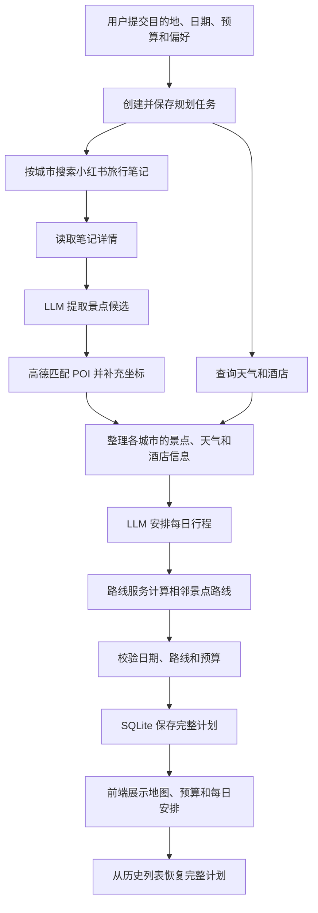
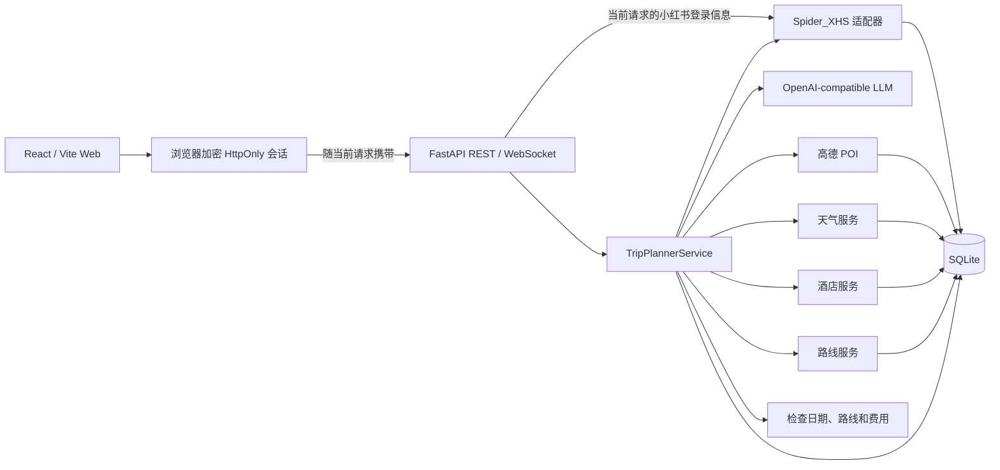

# TravelMind-AI

[](https://github.com/RichardLitt/standard-readme)
[](https://www.python.org/)
[](https://fastapi.tiangolo.com/)
[](https://react.dev/)
[](LICENSE)

> 参考小红书旅行分享，结合地图、天气和酒店信息，帮你安排多日行程。

[中文](README.md) | [English](README_en.md) | [日本語](README_ja.md)

TravelMind-AI 是一个旅行规划应用。填写目的地、日期、预算和偏好后，系统会搜索小红书
旅行笔记，整理值得去的景点，并查询高德地图上的地点、天气、酒店和路线信息，再安排每天的
游玩顺序、餐饮和住宿。你可以查看生成进度、每日行程、路线地图、费用估算和历史记录。

核心规划功能已实现，目前主要在完善行程合理性、任务稳定性和上线前检查。

本项目当前用于学习与技术验证，请在遵守数据来源平台规则、当地法律和地图服务条款的前提下使用。

## 目录

- [背景](#背景)
- [功能](#功能)
- [安装](#安装)
- [使用](#使用)
- [业务流程](#业务流程)
- [系统架构](#系统架构)
- [接口](#接口)
- [配置](#配置)
- [数据保存](#数据保存)
- [项目结构](#项目结构)
- [开发与测试](#开发与测试)
- [安全说明](#安全说明)
- [路线图](#路线图)
- [相关项目](#相关项目)
- [维护者](#维护者)
- [贡献](#贡献)
- [许可证](#许可证)

## 背景

仅依赖大模型知识生成旅行计划，容易出现不存在的地点、不准确的路线和过期的天气信息。
TravelMind-AI 通过以下方式整理旅行计划：

- 小红书提供真实旅行笔记和体验信息。
- 高德提供地点、坐标、天气、酒店、距离和路线步骤。
- 大语言模型（LLM）负责从笔记整理景点，并根据你的要求安排每日顺序和说明。
- 程序检查日期、城市、路线和费用合计，保存查询结果、任务进度和完整行程。

小红书笔记在规划时实时搜索，不会预先建立离线知识库。地点、天气、距离和耗时来自查询接口，
不会让模型凭空生成。

## 功能

### 当前已实现

- 在网页上填写单城市旅行需求，也可通过 API 提交多城市需求。
- 搜索、读取小红书笔记，整理景点名称、推荐理由和来源。
- 匹配高德地点信息（POI），补充地址、坐标、评分和图片。
- 查询城市天气和酒店，缓存结果以减少重复请求。
- 步行、驾车和公共交通路线计算，保留距离、耗时、步骤和折线坐标。
- 自动安排每日景点顺序、餐饮、住宿和出行建议。
- 检查行程日期、城市、路线起终点和费用合计是否一致。
- 后台生成行程，支持定时查询进度、WebSocket 进度推送和失败提示。
- 保存完整行程、每日安排和路线，支持历史分页与重新查看。
- React 响应式前端、中文/英文/日文界面、高德地图和 ECharts 预算图。
- 小红书 Cookie、二维码和手机号三种登录方式，会话按浏览器加密隔离。
- 未登录或登录过期时提示原因，并引导进入账户设置页面。

### 当前限制

- 小红书登录态以加密 HttpOnly Cookie 保存在客户端，不写入服务端数据库或进程全局变量。
- 小红书登录状态按浏览器独立保存，但项目还没有普通用户账户，历史行程尚未按用户隔离。
- 前端规划表单当前面向单城市；多城市能力可通过 REST API 使用。
- 酒店价格、景点评分等供应商未返回的字段保持为空，不由模型补造。
- 费用估算目前主要汇总住宿和餐饮；门票、交通等缺失费用不代表免费，也不等于最终消费。
- 当前使用单机 FastAPI + SQLite，尚未支持多台服务器共同处理任务。

## 安装

### 环境要求

- Python 3.12 或更高版本
- [uv](https://docs.astral.sh/uv/)
- Node.js 20.19 或更高版本（推荐 22.19）
- npm
- Docker Engine 24 或更高版本与 Docker Compose v2（使用容器部署时）
- 可用的小红书账号、高德开发者 Key 和 OpenAI-compatible LLM Key

### 安装后端依赖

```bash
uv sync
cp .env.example .env
```

### 安装小红书签名运行时

```bash
cd vendor/spider_xhs
npm install
cd ../..
```

### 安装前端依赖

```bash
cd ui
npm install
cp .env.example .env
cd ..
```

完成安装后，分别填写根目录 `.env` 和 `ui/.env`。不要将真实密钥提交到 Git。

### Docker Compose 部署

容器部署只需要配置根目录 `.env`，前端和后端统一通过 Nginx 入口访问：

```bash
cp .env.example .env
docker compose up -d --build
```

启动前至少填写 `TRAVELMIND_SESSION_SECRET`、`LLM_API_KEY`、
`AMAP_API_KEY`、`VITE_AMAP_JS_KEY` 和 `VITE_AMAP_SECURITY_CODE`。小红书 Cookie 不再写入
`.env`，启动后由各浏览器在账号管理页独立完成登录。

| 服务 | 默认地址 |
| --- | --- |
| Web 应用 | `http://127.0.0.1:8081` |
| 行程规划 | `http://127.0.0.1:8081/plan` |
| 历史行程 | `http://127.0.0.1:8081/library` |
| 账户设置 | `http://127.0.0.1:8081/settings` |
| OpenAPI 文档 | `http://127.0.0.1:8081/docs` |

常用运维命令：

```bash
docker compose ps
docker compose logs -f
docker compose down
```

`docker compose down` 不会删除 SQLite 数据；数据库保存在命名卷
`travelmind-ai-data` 中。只有明确需要同时清空行程、缓存和内容记录时，才使用
`docker compose down -v`。

`VITE_AMAP_JS_KEY` 和 `VITE_AMAP_SECURITY_CODE` 是前端构建参数，修改后需要重新构建
前端镜像。`TRAVELMIND_SESSION_SECRET` 必须在容器重启和多实例之间保持一致，否则浏览器中
已有的加密会话会失效。二维码和短信登录任务只在服务内存中临时保存 5 分钟，因此当前镜像使用
单个 Uvicorn Worker；登录成功后的会话只保存在对应浏览器中。

## 使用

### 启动服务

终端一，启动 FastAPI：

```bash
uv run uvicorn main:app --reload --host 127.0.0.1 --port 8000
```

终端二，启动 React 前端：

```bash
cd ui
npm run dev
```

默认入口：

| 页面 | 地址 |
| --- | --- |
| Web 应用 | `http://127.0.0.1:5173` |
| 行程规划 | `http://127.0.0.1:5173/plan` |
| 历史行程 | `http://127.0.0.1:5173/library` |
| 账户设置 | `http://127.0.0.1:5173/settings` |
| OpenAPI 文档 | `http://127.0.0.1:8000/docs` |

如果端口已被占用，Vite 会选择下一个可用端口，请以终端输出为准。

### 创建旅行计划

单城市请求示例：

```bash
curl -X POST http://127.0.0.1:8000/api/trip/plan \
  -H 'Content-Type: application/json' \
  -d '{
    "city": "深圳",
    "start_date": "2026-10-01",
    "end_date": "2026-10-03",
    "transportation": "transit",
    "accommodation": "舒适型酒店",
    "preferences": ["美食", "城市漫步"],
    "free_text_input": "节奏轻松，避开过度拥挤区域",
    "language": "zh",
    "note_limit": 4,
    "travelers": 2,
    "total_budget": 6000,
    "hotel_budget_max": 900
  }'
```

接口返回 `202 Accepted` 和任务查询地址：

```json
{
  "task_id": "9fd32f0d4f38464d8ca7100af700f21a",
  "status": "submitted",
  "status_url": "/api/trip/status/9fd32f0d4f38464d8ca7100af700f21a",
  "ws_url": "/api/trip/ws/9fd32f0d4f38464d8ca7100af700f21a",
  "message": "旅行规划任务已提交"
}
```

查询任务：

```bash
curl http://127.0.0.1:8000/api/trip/status/9fd32f0d4f38464d8ca7100af700f21a
```

任务状态依次为 `submitted`、`processing`、`completed` 或 `failed`。成功响应中的
`result` 是完整行程；失败响应包含稳定的 `error_code` 和面向客户端的错误说明。

完整规划和实时小红书接口要求当前客户端先完成登录。Web 页面会自动携带 HttpOnly Cookie；
命令行客户端需要在登录请求中保存响应 Cookie，并在后续请求中使用同一个 Cookie Jar。

多城市请求使用 `cities` 替代 `city`，各城市天数之和必须等于起止日期覆盖的自然日数量：

```json
{
  "cities": [
    { "city": "上海", "days": 2 },
    { "city": "苏州", "days": 2 }
  ],
  "start_date": "2026-10-01",
  "end_date": "2026-10-04"
}
```

## 业务流程



提交接口立即返回 `task_id`，FastAPI 在后台生成行程。前端定时查询进度，后端也支持
WebSocket 进度推送。服务重启后，已保存的任务状态和行程仍可查询，但未完成的规划不会自动继续。

## 系统架构



小红书原始 Cookie 只在验证登录和处理当前请求时临时使用。浏览器保存加密后的登录信息，
服务端不会把某个浏览器的 Cookie 共享给其他人。二维码和短信登录任务只在内存中保存 5 分钟。

### 代码分工

| 层 | 目录 | 职责 |
| --- | --- | --- |
| API | `app/routers`、`app/schemas` | HTTP/WebSocket、输入验证、REST 模型和错误响应 |
| 数据结构 | `app/models` | 定义行程、景点、酒店、天气和路线需要哪些字段 |
| 业务处理 | `app/services` | 整理笔记、查询信息、安排日程、检查结果和更新进度 |
| 集成 | `app/integrations` | 小红书、LLM 和高德供应商适配 |
| 存储 | `app/storage` | SQLite 表、缓存、完整计划和事务 |
| Web | `ui/src` | 路由、页面、组件、Zustand 状态和 Axios 请求 |

接口的请求和响应格式与程序内部的数据结构分开维护。小红书、高德等服务返回的内容，
需要先整理成统一格式，再用于规划和页面展示。

### 技术栈

| 范围 | 技术 |
| --- | --- |
| 后端 | Python 3.12、FastAPI、Pydantic、Uvicorn、Loguru |
| LLM | OpenAI Python SDK、OpenAI-compatible Chat Completions |
| 内容 | Spider_XHS PC 客户端、PyExecJS、Node.js |
| 地图 | 高德 Web 服务 API、高德地图 JS API |
| 存储 | SQLite、WAL |
| 前端 | React 18、TypeScript、Vite、React Router、Zustand、Axios |
| 可视化 | ECharts、Lucide、AMap JS API Loader |

## 接口

### 完整行程

| 方法 | 路径 | 用途 |
| --- | --- | --- |
| `POST` | `/api/trip/plan` | 提交完整旅行规划任务 |
| `GET` | `/api/trip/status/{task_id}` | 查询任务进度和最终结果 |
| `WS` | `/api/trip/ws/{task_id}` | 订阅任务状态变化 |
| `GET` | `/api/trip/history` | 分页获取已完成计划摘要 |
| `GET` | `/api/trip/plan/{plan_id}` | 按计划 ID 恢复完整行程 |

历史行程接口使用查询参数 `page`（默认 `1`）和 `page_size`（默认 `8`，最大 `20`），
响应同时返回 `total` 与 `total_pages`，供客户端生成分页控件。

### 小红书内容

| 方法 | 路径 | 用途 |
| --- | --- | --- |
| `GET` | `/api/xhs/health` | 检查内容客户端运行条件 |
| `POST` | `/api/xhs/search` | 搜索旅行笔记 |
| `GET` | `/api/xhs/notes/{note_id}` | 读取笔记详情 |
| `POST` | `/api/xhs/attractions` | 搜索笔记并提取、补全景点 |
| `GET` | `/api/xhs/attractions/{extraction_id}` | 恢复一次景点提取结果 |

### 地点、天气、酒店和路线

| 方法 | 路径 | 用途 |
| --- | --- | --- |
| `GET` | `/api/poi/search` | 搜索地点 |
| `GET` | `/api/poi/detail/{poi_id}` | 查询 POI 详情 |
| `GET` | `/api/poi/photo` | 查询并缓存景点图片 |
| `GET` | `/api/map/poi` | TripStar 兼容 POI 搜索入口 |
| `GET` | `/api/weather` | 按城市和日期查询天气 |
| `GET` | `/api/map/weather` | TripStar 兼容天气入口 |
| `GET` | `/api/hotels/search` | 按偏好、预算和区域搜索酒店 |
| `POST` | `/api/map/route` | 计算两点间路线 |

路线接口只负责已确定起终点之间的距离、耗时和导航步骤；景点访问顺序由行程规划器决定。

### 小红书客户端登录

这些接口面向访问者开放，不要求管理密钥。登录成功后仅向当前浏览器签发加密的 HttpOnly
Cookie；二维码和手机号登录任务 5 分钟后失效。单个客户端每 60 秒最多创建 8 个登录任务，
服务端同时最多保留 12 个任务。

| 方法 | 路径 | 用途 |
| --- | --- | --- |
| `GET` | `/api/xhs/login/methods` | 获取可用登录方式 |
| `POST` | `/api/xhs/login/qrcode/start` | 创建二维码登录任务 |
| `GET` | `/api/xhs/login/{login_id}/qrcode` | 获取登录二维码 |
| `GET` | `/api/xhs/login/{login_id}/status` | 查询登录状态并领取登录结果 |
| `POST` | `/api/xhs/login/phone/start` | 发送手机号验证码 |
| `POST` | `/api/xhs/login/phone/verify` | 验证短信验证码 |
| `POST` | `/api/xhs/login/cookie` | 验证 Cookie 并建立浏览器会话 |
| `DELETE` | `/api/xhs/login/session` | 清除当前浏览器的小红书登录态 |

## 配置

### 后端 `.env`

| 变量 | 必需 | 默认值 | 说明 |
| --- | --- | --- | --- |
| `TRAVELMIND_SESSION_SECRET` | 是 | 无 | 加密浏览器小红书会话，至少 32 个随机字符 |
| `LLM_API_KEY` | 是 | 无 | OpenAI-compatible 服务密钥 |
| `LLM_BASE_URL` | 否 | `https://api.openai.com/v1` | Chat Completions 服务地址 |
| `LLM_MODEL_ID` | 否 | `gpt-4o-mini` | 景点整理和每日行程生成模型 |
| `LLM_TIMEOUT` | 否 | `180` | 请求超时秒数 |
| `LLM_ENABLE_THINKING` | 否 | `false` | 百炼兼容服务的深度思考开关 |
| `AMAP_API_KEY` | 是 | 无 | 后端 POI、天气、酒店和路线使用的高德 Web 服务 Key |
| `TRAVELMIND_DATA_DIR` | 否 | `./data` | SQLite 数据目录 |
| `WEATHER_CACHE_TTL_SECONDS` | 否 | `10800` | 天气缓存有效期 |
| `HOTEL_CACHE_TTL_SECONDS` | 否 | `86400` | 酒店缓存有效期 |
| `ROUTE_CACHE_TTL_SECONDS` | 否 | `86400` | 路线缓存有效期 |

兼容变量：LLM 还可读取 `OPENAI_API_KEY`、`OPENAI_BASE_URL`、`OPENAI_MODEL`；高德后端还可读取
`AMAP_MAPS_API_KEY`、`VITE_AMAP_WEB_KEY`。新部署建议使用表格中的主变量。

### 前端 `ui/.env`

```dotenv
VITE_AMAP_JS_KEY=your_web_js_key
VITE_AMAP_SECURITY_CODE=your_security_code
```

高德 Web 服务 Key 与 Web JS Key 用途不同，不能混用。前端变量会进入浏览器构建产物，
应在高德控制台配置域名白名单和安全密钥，不要把后端服务 Key 放进 `VITE_*` 变量。

## 数据保存

默认只使用一个 SQLite 数据库：

```text
data/travelmind.db
```

`travelmind.db-wal` 和 `travelmind.db-shm` 是 SQLite WAL 模式的辅助文件，不是独立数据库。

数据库保存：

- 小红书笔记、提取记录和景点候选。
- POI、天气、酒店和路线缓存。
- 规划请求、任务状态和错误码。
- 完整行程 JSON、逐日安排和路线段。

前端 Zustand 只在浏览器中缓存最近查看的行程和用户输入。历史行程页面始终通过
`/api/trip/history` 和 `/api/trip/plan/{plan_id}` 读取 SQLite，不以浏览器缓存代替数据库。
小红书登录态不写入 SQLite；服务端只在单次请求或正在执行的规划任务中短暂解密使用。

## 项目结构

```text
TravelMind-AI/
├── app/
│   ├── integrations/       # 小红书、LLM 和高德适配器
│   ├── models/             # 行程、景点、酒店等数据结构
│   ├── routers/            # REST 与 WebSocket 路由
│   ├── schemas/            # 独立 API 请求/响应模型
│   ├── services/           # 信息查询与完整行程生成
│   ├── storage/            # SQLite 数据读写和查询缓存
│   └── xhs_session.py      # 浏览器会话加密、校验与 Cookie 交付
├── data/                   # 本地运行数据，不提交数据库文件
├── tests/                  # unittest 自动化测试
├── ui/                     # React / Vite Web 应用
│   ├── Dockerfile          # 前端构建与 Nginx 运行镜像
│   └── nginx.conf          # SPA、API 与 WebSocket 反向代理
├── vendor/spider_xhs/      # 小红书 PC 客户端运行时
├── .dockerignore           # 后端镜像构建忽略规则
├── .env.example            # 后端配置模板
├── compose.yaml            # 前后端服务、网络和数据保存
├── Dockerfile              # FastAPI 与小红书签名运行镜像
├── LICENSE                 # MIT 许可证
├── main.py                 # FastAPI 入口
├── pyproject.toml          # Python 项目与依赖
└── TODO.md                 # 路线图和验收事项
```

## 开发与测试

运行后端测试：

```bash
uv run python -m unittest discover -s tests -v
```

运行前端检查：

```bash
cd ui
npm run lint
npm run build
```

提交前检查空白和冲突标记：

```bash
git diff --check
```

自动化测试使用模拟接口返回，不依赖真实 Cookie、外部网络或收费 API。使用真实服务的
完整流程检查应单独执行，日志和测试输出不能包含密钥或完整登录信息。

## 安全说明

- `.env`、数据库文件、Cookie、会话密钥和 API Key 不得提交到版本库。
- 小红书原始 Cookie 不返回响应正文，也不写入 SQLite、日志、Zustand 或 `localStorage`。
- 登录成功后服务端签发 7 天有效的加密 HttpOnly Cookie，每个浏览器独立保存和携带。
- `TRAVELMIND_SESSION_SECRET` 必须使用至少 32 个随机字符，不能复用其他 API Key。
- 退出登录只清除当前浏览器的登录状态。服务端暂不支持单独强制某个浏览器退出；更换会话密钥会使所有浏览器重新登录。
- API 响应、业务表和日志不得包含 Cookie、`xsec_token`、Authorization 或完整 Prompt。
- 公开登录接口已限制客户端创建频率和服务端任务容量，但不替代完整用户系统。
- 开放公网访问前，应启用 HTTPS，检查用户访问权限、代理设置、请求频率限制、密钥保存和操作记录。

## 路线图

- 检查每日游玩和交通总时长、景点距离与住宿区域，完善费用估算说明。
- 避免重复执行任务，支持重试、服务重启恢复、页面刷新继续查看和取消。
- 增加普通用户账户，限制每个用户只能访问自己的行程。
- 补齐行程编辑、历史管理、多城市表单、收藏保存和图片失败提示。

真实服务检查、HTTPS、监控和备份等上线事项见 [TODO.md](TODO.md)。

## 相关项目

- [Spider_XHS](https://github.com/cv-cat/Spider_XHS)：小红书 PC 请求签名与登录能力参考。
- [TripStar](https://github.com/1sdv/TripStar)：旅行规划业务流程和部分兼容接口参考。
- [Standard Readme](https://github.com/RichardLitt/standard-readme)：本文档结构规范。

TravelMind-AI 的代码、数据结构和数据保存由本项目独立维护；引用项目的许可与使用条件请分别查看其仓库。

## 维护者

- wen.yao

## 贡献

欢迎通过 Issue 或 Pull Request 提交问题和改进。贡献前请：

1. 从最新主分支创建范围明确的功能分支。
2. 接口格式、内部数据结构和外部服务调用分开维护。
3. 为新增规则、错误处理和数据保存补充测试。
4. 运行后端测试、前端 Lint 和生产构建。
5. 确认提交中不包含 `.env`、数据库、Cookie、Key、日志或用户隐私数据。

## 许可证

本项目采用 [MIT License](LICENSE) 开源。你可以在保留版权声明和许可证声明的前提下使用、
复制、修改、合并、发布、分发、再许可或销售本软件。

项目引用和依赖的第三方代码仍适用各自的许可证与使用条款。
