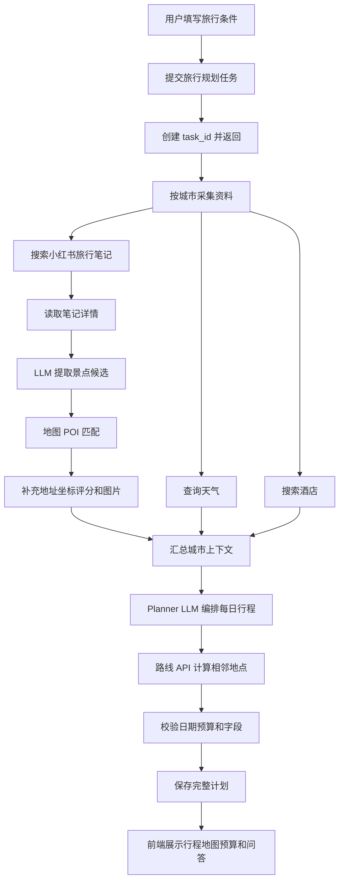
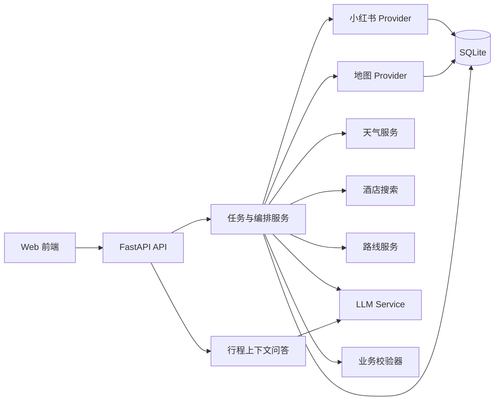

# TravelMind-AI

> AI 驱动的个性化旅行规划系统

[中文](README.md) | [English](README_en.md) | [日本語](README_ja.md)

项目仅供学习参考

参考借鉴项目：https://github.com/cv-cat/Spider_XHS.git
参考借鉴项目：https://github.com/1sdv/TripStar.git

TravelMind-AI 面向真实旅行决策场景，将用户偏好、真实旅行内容、地图地点事实、天气、
酒店和路线信息组合为可执行的多日行程。系统采用分层架构：大模型负责理解、提取和
编排，外部服务负责提供可验证事实，业务层负责校验、缓存、持久化和任务状态。

## 目录

- [TravelMind-AI](#travelmind-ai)
  - [目录](#目录)
  - [产品能力](#产品能力)
  - [完整业务流程](#完整业务流程)
    - [规划与事实的职责](#规划与事实的职责)
  - [系统架构](#系统架构)
    - [代码分层](#代码分层)
  - [数据来源边界](#数据来源边界)
  - [接口契约](#接口契约)
    - [旅行规划](#旅行规划)
    - [小红书内容](#小红书内容)
    - [POI、天气和路线](#poi天气和路线)
    - [行程问答与偏好记忆](#行程问答与偏好记忆)
  - [领域模型](#领域模型)
  - [项目结构](#项目结构)
  - [持久化设计](#持久化设计)
  - [配置说明](#配置说明)
  - [本地运行](#本地运行)
  - [开发检查](#开发检查)
  - [错误和可观测性](#错误和可观测性)
  - [安全约束](#安全约束)
  - [功能清单](#功能清单)

## 产品能力

- **个性化行程**：根据城市、日期、停留天数、交通、住宿和兴趣生成每日安排。
- **小红书内容提取**：搜索旅行笔记，读取正文，提取景点、评价、游玩时长和预约提醒。
- **POI 标准化**：通过高德或 Google 地图匹配景点，补充 POI ID、地址、坐标、评分和电话。
- **天气查询**：按城市和日期查询天气预报，为每日安排提供事实依据。
- **酒店搜索**：按城市、住宿偏好、预算和景点区域搜索酒店候选。
- **路线计算**：计算相邻景点的距离、耗时、交通方式和路线步骤。
- **多城市旅行**：支持城市顺序、停留天数、城市切换日和城际交通建议。
- **预算明细**：汇总门票、酒店、餐饮、市内交通和城际交通费用。
- **地图展示**：展示景点 POI、每日路线和城市移动关系。
- **知识图谱**：将城市、日期、景点、酒店、餐饮和预算转换为关系网络。
- **行程问答**：基于当前行程上下文回答预约、票价、路线和调整问题。
- **偏好记忆**：在用户授权后保存稳定偏好，并用于后续行程推荐。
- **历史计划**：保存任务和完整计划，支持按计划 ID 恢复查看。

## 完整业务流程



任务提交后通过轮询或 WebSocket 返回进度。进度消息覆盖当前城市和当前业务动作，
例如小红书检索、LLM 提取、POI 匹配、天气查询、酒店搜索、路线计算、计划校验和保存。

### 规划与事实的职责

```text
Planner LLM：决定景点组合、访问顺序、每日节奏、餐饮建议和文字说明
地图 API：提供 POI、地址、坐标、距离、耗时和路线步骤
天气 API：提供天气、温度、风向和风力
小红书：提供旅行笔记、真实评价、预约提示和实拍图片
业务校验器：校验日期、坐标、金额、必填字段和城市归属
```

路线不能完全由大模型推理。大模型负责“怎么安排”，地图路线服务负责“实际需要多久、
走哪条路线”，两者结果在业务层合并。

## 系统架构



### 代码分层

| 目录 | 职责 |
| --- | --- |
| `app/routers` | HTTP、WebSocket 路由、参数校验和错误响应 |
| `app/schemas` | API 请求和响应模型 |
| `app/models` | POI、行程、天气、酒店和路线领域模型 |
| `app/services` | 景点提取、POI 补全、任务编排和业务规则 |
| `app/integrations` | Spider_XHS、LLM、高德和 Google 适配器 |
| `app/storage` | SQLite 表结构、缓存、历史数据和事务 |
| `vendor/spider_xhs` | 小红书 PC 签名客户端及其运行依赖 |

外部服务只能通过 `integrations` 进入业务层，业务层不直接依赖供应商原始字段。

## 数据来源边界

| 数据或判断 | 来源 | 处理规则 |
| --- | --- | --- |
| 游记正文、真实评价、预约提示 | 小红书 | 保存原文和来源，不保存认证令牌 |
| 景点候选、游玩时长、推荐理由 | LLM | 只从游记提取，并经过 Pydantic 校验 |
| POI ID、地址、坐标、电话、评分 | 地图 API | 只接受供应商返回值，不由 LLM 编造 |
| 天气温度和天气状况 | 天气 API | 作为规划事实输入 |
| 酒店名称、地址和位置 | 地图文本搜索 | LLM 负责筛选和说明，不编造基础信息 |
| 景点访问顺序和每日节奏 | Planner LLM | 结合用户偏好、时间和地点分布 |
| 距离、耗时和路线步骤 | 路线 API | 用于校验和展示 |
| 日期覆盖、城市归属和预算合计 | 业务校验器 | 使用确定性逻辑计算 |

## 接口契约

### 旅行规划

```text
POST /api/trip/plan
GET  /api/trip/status/{task_id}
WS   /api/trip/ws/{task_id}
GET  /api/trip/history
GET  /api/trip/plan/{plan_id}
```

`POST /api/trip/plan` 接收城市、日期、停留天数、交通方式、住宿偏好、旅行偏好和额外要求，
立即返回 `task_id`。任务完成后返回包含每日计划、景点、餐饮、酒店、天气、路线和预算的
完整 `TripPlan`。

### 小红书内容

```text
GET  /api/xhs/health
POST /api/xhs/search
GET  /api/xhs/notes/{note_id}
POST /api/xhs/attractions
GET  /api/xhs/attractions/{extraction_id}
```

其中 `POST /api/xhs/attractions` 是景点资料处理入口：

```text
小红书搜索 -> 笔记详情 -> LLM 提取 -> POI 匹配 -> SQLite 保存
```

请求示例：

```json
{
  "city": "北京",
  "keywords": "历史文化",
  "language": "zh",
  "note_limit": 4
}
```

### POI、天气和路线

```text
GET  /api/poi/search?keywords=故宫&city=北京
GET  /api/poi/detail/{poi_id}
GET  /api/poi/photo?name=故宫&city=北京
GET  /api/map/poi?keywords=故宫&city=北京
GET  /api/weather?city=北京&start_date=2026-08-28&end_date=2026-08-30
GET  /api/map/weather?city=北京
POST /api/map/route
```

天气接口支持可选的 `start_date` 和 `end_date`，只返回供应商有效预报范围内的数据；
相同供应商、城市和日期的结果默认缓存三小时。POI 搜索、天气和路线返回地图服务的
事实数据。景点图片接口按需从小红书查询首图，并缓存图片地址。

### 行程问答与偏好记忆

```text
POST   /api/chat/ask
GET    /api/memory/list
POST   /api/memory/add-explicit
DELETE /api/memory/item
DELETE /api/memory/clear
```

问答接口只使用当前计划上下文。偏好记忆默认关闭，开启后支持查询、添加、删除和清空。

## 领域模型

- `TripRequest`：城市、日期、停留天数、交通、住宿、偏好和额外要求。
- `TripPlan`：城市列表、日期范围、每日计划、天气、总体建议和预算。
- `DayPlan`：当天城市、景点、餐饮、酒店、交通方式和城市切换信息。
- `Attraction`：景点名称、POI ID、地址、坐标、游玩时长、门票、预约和图片。
- `Hotel`：酒店名称、地址、坐标、评分、价格区间和预估费用。
- `WeatherInfo`：日期、城市、天气、温度、风向和风力。
- `RouteSegment`：起终点、交通方式、距离、耗时和路线步骤。
- `Budget`：门票、酒店、餐饮、市内交通、城际交通和总费用。

所有外部响应经过模型校验后才能进入 Planner。价格、温度、距离和耗时使用数字字段；
缺失信息使用空值，不把单位或算式写入数字字段。

## 项目结构

```text
TravelMind-AI/
├── app/
│   ├── integrations/       # 小红书、LLM、高德和 Google 外部服务适配器
│   ├── models/             # 领域对象
│   ├── routers/            # HTTP 和 WebSocket 路由
│   ├── schemas/            # API 输入输出模型
│   ├── services/           # 业务流程和编排
│   └── storage/            # SQLite 持久化与缓存
├── vendor/spider_xhs/      # 小红书 PC 签名客户端
├── data/                   # 本地 SQLite 数据目录
├── main.py                 # FastAPI 应用入口
├── pyproject.toml          # Python 依赖和项目元数据
├── TODO.md                # 功能、测试和验收清单
└── README*.md              # 多语言项目文档
```

模块之间使用单向依赖：路由调用业务服务，业务服务调用 Provider 和仓储，Provider 不
直接依赖路由。这样可以在不改变业务契约的情况下替换地图供应商或 LLM 服务。

## 持久化设计

默认数据库：

```text
data/travelmind.db
```

通过 `TRAVELMIND_DATA_DIR` 可以指定其他数据目录。数据库保存：

- 小红书笔记原文和来源元数据
- 景点候选及提取记录
- POI 搜索结果和详情缓存
- 景点图片地址和查询时间
- 天气、酒店和路线缓存
- 旅行任务、完整计划和历史记录

缓存记录应包含供应商、查询条件和时间信息，以便判断是否需要重新获取。写入数据库前
必须过滤 Cookie、`xsec_token`、Authorization、API Key 和完整请求头。

## 配置说明

复制配置模板：

```bash
cp .env.example .env
```

```dotenv
# 小红书网页端登录 Cookie，仅用于服务进程内的上游请求
TRAVELMIND_XHS_COOKIE=replace_me

# OpenAI-compatible LLM
LLM_API_KEY=replace_me
LLM_BASE_URL=https://api.openai.com/v1
LLM_MODEL_ID=gpt-4o-mini
LLM_TIMEOUT=60

# 高德 Web 服务 Key，用于后端 POI、天气和路线查询
AMAP_API_KEY=replace_me

# 天气缓存有效期，单位为秒
WEATHER_CACHE_TTL_SECONDS=10800

# SQLite 数据目录，可选
# TRAVELMIND_DATA_DIR=/absolute/path/travelmind-data
```

兼容变量：

- 小红书：`TRAVELMIND_XHS_COOKIE`、`XHS_COOKIE`、`COOKIES`
- LLM：`LLM_API_KEY`、`OPENAI_API_KEY`、`LLM_BASE_URL`、`OPENAI_BASE_URL`
- 高德：`AMAP_API_KEY`、`AMAP_MAPS_API_KEY`、`VITE_AMAP_WEB_KEY`

后端高德 Web 服务 Key 与前端地图 JS Key 是不同用途的配置，不能混用。

## 本地运行

环境要求：Python 3.12 或更高版本、Node.js 20、`uv`。

```bash
uv sync
cp .env.example .env
uv run uvicorn main:app --reload
```

API 文档：

```text
http://127.0.0.1:8000/docs
```

## 开发检查

```bash
PYTHONDONTWRITEBYTECODE=1 .venv/bin/python -m compileall -q app main.py
UV_CACHE_DIR=/tmp/travelmind-uv-cache uv lock --check
```

涉及外部服务的测试应优先使用假 Provider，确认模型转换、缓存、持久化、降级和错误处理
后，再执行真实 API 请求。

## 错误和可观测性

接口错误按来源区分为配置错误、认证错误、供应商网络错误、LLM 解析错误、数据校验错误
和持久化错误。终端日志使用统一时间、级别、任务 ID、城市、业务动作和结果数量，便于
定位一次行程从提交到完成的全过程。日志不得包含完整笔记正文、用户隐私、Cookie、令牌
或 API Key。

## 安全约束

- 真实 Cookie 只配置在 `.env` 或安全的运行时配置中。
- API 不返回 Cookie、`xsec_token`、Authorization 或 API Key。
- SQLite 不保存认证字段和完整请求头。
- 日志不打印密钥、Cookie、令牌和完整 LLM Prompt。
- 外部服务原始错误经过业务层转换后再返回客户端。
- 任务失败时返回可识别错误，不返回半成品计划。
- 用户偏好记忆必须经过授权，并支持清除。

## 功能清单

详细的接口、数据模型、测试范围和验收要求见 [TODO.md](TODO.md)。README 描述完整产品
目标和稳定契约，TODO 记录具体实现工作，不将产品文档绑定到某一次开发过程。
