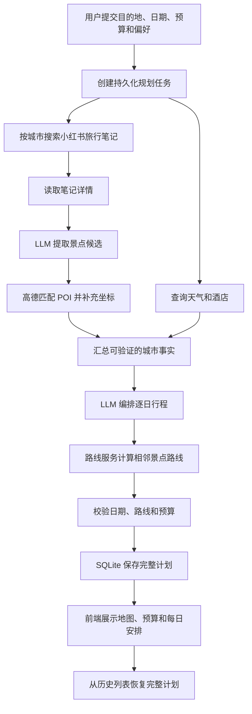
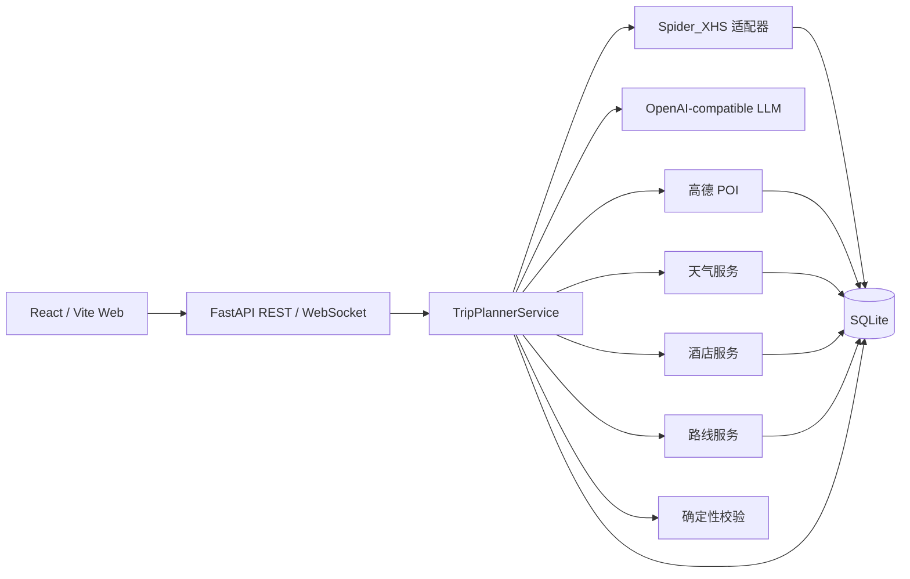

# TravelMind-AI

[](https://github.com/RichardLitt/standard-readme)
[](https://www.python.org/)
[](https://fastapi.tiangolo.com/)
[](https://react.dev/)
[](LICENSE)

> 从真实旅行内容出发，结合地图事实和大模型编排，生成可执行的多日旅行计划。

[中文](README.md) | [English](README_en.md) | [日本語](README_ja.md)

TravelMind-AI 是一个面向个人旅行决策的全栈应用。用户提交目的地、日期、预算和偏好后，
系统会检索小红书旅行笔记、提取景点候选、补全高德 POI、天气、酒店和路线事实，再由
大模型编排逐日行程。任务进度和完整结果保存在 SQLite 中，Web 前端提供规划、进度、地图、
预算和历史行程页面。

本项目当前用于学习与技术验证，请在遵守数据来源平台规则、当地法律和地图服务条款的前提下使用。

## 目录

- [背景](#背景)
- [功能](#功能)
- [安装](#安装)
- [使用](#使用)
- [业务流程](#业务流程)
- [系统架构](#系统架构)
- [接口](#接口)
- [配置](#配置)
- [持久化](#持久化)
- [项目结构](#项目结构)
- [开发与测试](#开发与测试)
- [安全说明](#安全说明)
- [路线图](#路线图)
- [相关项目](#相关项目)
- [维护者](#维护者)
- [贡献](#贡献)
- [许可证](#许可证)

## 背景

仅依赖大模型知识生成旅行计划，容易出现不存在的地点、不准确的路线和过期的天气信息。
TravelMind-AI 将“内容灵感”“事实查询”“行程决策”拆成独立环节：

- 小红书提供真实旅行笔记和体验信息。
- 高德提供地点、坐标、天气、酒店、距离和路线步骤。
- LLM 负责从笔记提取景点，并结合用户条件编排每日顺序和说明。
- 业务服务负责字段校验、日期覆盖、预算汇总、缓存、任务状态和持久化。

当前小红书能力属于实时内容检索，不是向量数据库或离线 RAG。地图和天气数值也不会由
LLM 推测生成。

## 功能

### 当前已实现

- 单城市 Web 规划表单，以及单城市和多城市 REST 请求模型。
- 小红书笔记搜索、详情读取、景点结构化提取和来源记录。
- 高德 POI 匹配，补充地址、坐标、评分和图片。
- 城市天气预报、酒店搜索及 SQLite 缓存。
- 步行、驾车和公共交通路线计算，保留距离、耗时、步骤和折线坐标。
- LLM 逐日行程编排，包括景点顺序、餐饮、住宿和整体建议。
- 日期、城市归属、路线端点和预算的确定性校验。
- 后台规划任务、轮询状态、WebSocket 状态订阅和失败错误码。
- 完整计划、每日安排和路线段持久化，支持历史列表与计划恢复。
- React 响应式前端、中文/英文/日文界面、高德地图和 ECharts 预算图。
- 小红书系统账号的 Cookie、二维码和手机号三种管理员登录方式。
- 未登录时返回稳定认证错误，并引导前端进入管理员维护页面。

### 能力边界

- 普通用户不需要提交个人小红书账号，内容账号由系统管理员维护。
- 前端规划表单当前面向单城市；多城市能力可通过 REST API 使用。
- 酒店价格、景点评分等供应商未返回的字段保持为空，不由模型补造。
- 预算只汇总当前已知的餐饮、住宿、景点和交通估算，不等同于最终消费。
- 当前是单机 FastAPI + SQLite 架构，不包含多租户用户系统或分布式任务队列。

## 安装

### 环境要求

- Python 3.12 或更高版本
- [uv](https://docs.astral.sh/uv/)
- Node.js 20 或更高版本
- npm
- Docker Engine 24 或更高版本与 Docker Compose v2（使用容器部署时）
- 可用的小红书系统账号、高德开发者 Key 和 OpenAI-compatible LLM Key

### 安装后端依赖

```bash
uv sync
cp .env.example .env
```

### 安装小红书签名运行时

```bash
cd vendor/spider_xhs
npm install
cd ../..
```

### 安装前端依赖

```bash
cd ui
npm install
cp .env.example .env
cd ..
```

完成安装后，分别填写根目录 `.env` 和 `ui/.env`。不要将真实密钥提交到 Git。

### Docker Compose 部署

容器部署只需要配置根目录 `.env`，前端和后端统一通过 Nginx 入口访问：

```bash
cp .env.example .env
docker compose up -d --build
```

启动前至少填写 `TRAVELMIND_ADMIN_KEY`、`LLM_API_KEY`、`AMAP_API_KEY`、
`VITE_AMAP_JS_KEY` 和 `VITE_AMAP_SECURITY_CODE`。`TRAVELMIND_XHS_COOKIE` 可选；
也可以启动后在系统账号管理页完成登录。

| 服务 | 默认地址 |
| --- | --- |
| Web 应用 | `http://127.0.0.1:8080` |
| 行程规划 | `http://127.0.0.1:8080/plan` |
| 历史行程 | `http://127.0.0.1:8080/library` |
| 系统账号管理 | `http://127.0.0.1:8080/admin/integrations/xhs` |
| OpenAPI 文档 | `http://127.0.0.1:8080/docs` |

常用运维命令：

```bash
docker compose ps
docker compose logs -f
docker compose down
```

`docker compose down` 不会删除 SQLite 数据；数据库保存在命名卷
`travelmind-ai-data` 中。只有明确需要同时清空行程、缓存和内容记录时，才使用
`docker compose down -v`。

`VITE_AMAP_JS_KEY` 和 `VITE_AMAP_SECURITY_CODE` 是前端构建参数，修改后需要重新构建
前端镜像。管理员通过二维码或手机号获得的小红书登录态仅保存在后端进程；后端容器重启后，
会重新读取 `.env` 中的 `TRAVELMIND_XHS_COOKIE`，未配置时需要管理员重新登录。

## 使用

### 启动服务

终端一，启动 FastAPI：

```bash
uv run uvicorn main:app --reload --host 127.0.0.1 --port 8000
```

终端二，启动 React 前端：

```bash
cd ui
npm run dev
```

默认入口：

| 页面 | 地址 |
| --- | --- |
| Web 应用 | `http://127.0.0.1:5173` |
| 行程规划 | `http://127.0.0.1:5173/plan` |
| 历史行程 | `http://127.0.0.1:5173/library` |
| 系统账号管理 | `http://127.0.0.1:5173/admin/integrations/xhs` |
| OpenAPI 文档 | `http://127.0.0.1:8000/docs` |

如果端口已被占用，Vite 会选择下一个可用端口，请以终端输出为准。

### 创建旅行计划

单城市请求示例：

```bash
curl -X POST http://127.0.0.1:8000/api/trip/plan \
  -H 'Content-Type: application/json' \
  -d '{
    "city": "深圳",
    "start_date": "2026-10-01",
    "end_date": "2026-10-03",
    "transportation": "transit",
    "accommodation": "舒适型酒店",
    "preferences": ["美食", "城市漫步"],
    "free_text_input": "节奏轻松，避开过度拥挤区域",
    "language": "zh",
    "note_limit": 4,
    "travelers": 2,
    "total_budget": 6000,
    "hotel_budget_max": 900
  }'
```

接口返回 `202 Accepted` 和任务查询地址：

```json
{
  "task_id": "9fd32f0d4f38464d8ca7100af700f21a",
  "status": "submitted",
  "status_url": "/api/trip/status/9fd32f0d4f38464d8ca7100af700f21a",
  "ws_url": "/api/trip/ws/9fd32f0d4f38464d8ca7100af700f21a",
  "message": "旅行规划任务已提交"
}
```

查询任务：

```bash
curl http://127.0.0.1:8000/api/trip/status/9fd32f0d4f38464d8ca7100af700f21a
```

任务状态依次为 `submitted`、`processing`、`completed` 或 `failed`。成功响应中的
`result` 是完整行程；失败响应包含稳定的 `error_code` 和面向客户端的错误说明。

多城市请求使用 `cities` 替代 `city`，各城市天数之和必须等于起止日期覆盖的自然日数量：

```json
{
  "cities": [
    { "city": "上海", "days": 2 },
    { "city": "苏州", "days": 2 }
  ],
  "start_date": "2026-10-01",
  "end_date": "2026-10-04"
}
```

## 业务流程



提交接口立即返回 `task_id`，实际规划由 FastAPI 后台任务执行。前端当前通过状态接口轮询，
后端同时提供 WebSocket。服务重启后，已写入 SQLite 的任务状态和完整计划仍可查询。

## 系统架构



### 分层约束

| 层 | 目录 | 职责 |
| --- | --- | --- |
| API | `app/routers`、`app/schemas` | HTTP/WebSocket、输入验证、REST 模型和错误响应 |
| 领域 | `app/models` | 与框架和接口层分离的旅行、景点、酒店、天气和路线模型 |
| 业务 | `app/services` | 内容提取、事实查询、行程编排、校验和任务进度 |
| 集成 | `app/integrations` | 小红书、LLM 和高德供应商适配 |
| 存储 | `app/storage` | SQLite 表、缓存、完整计划和事务 |
| Web | `ui/src` | 路由、页面、组件、Zustand 状态和 Axios 请求 |

REST schema 与领域 model 保持分离。供应商原始结构必须先转换为领域对象，不能直接进入
规划器或透传到前端。

### 技术栈

| 范围 | 技术 |
| --- | --- |
| 后端 | Python 3.12、FastAPI、Pydantic、Uvicorn、Loguru |
| LLM | OpenAI Python SDK、OpenAI-compatible Chat Completions |
| 内容 | Spider_XHS PC 客户端、PyExecJS、Node.js |
| 地图 | 高德 Web 服务 API、高德地图 JS API |
| 存储 | SQLite、WAL |
| 前端 | React 18、TypeScript、Vite、React Router、Zustand、Axios |
| 可视化 | ECharts、Lucide、AMap JS API Loader |

## 接口

### 完整行程

| 方法 | 路径 | 用途 |
| --- | --- | --- |
| `POST` | `/api/trip/plan` | 提交完整旅行规划任务 |
| `GET` | `/api/trip/status/{task_id}` | 查询任务进度和最终结果 |
| `WS` | `/api/trip/ws/{task_id}` | 订阅任务状态变化 |
| `GET` | `/api/trip/history` | 获取已完成计划摘要 |
| `GET` | `/api/trip/plan/{plan_id}` | 按计划 ID 恢复完整行程 |

### 小红书内容

| 方法 | 路径 | 用途 |
| --- | --- | --- |
| `GET` | `/api/xhs/health` | 检查内容客户端运行条件 |
| `POST` | `/api/xhs/search` | 搜索旅行笔记 |
| `GET` | `/api/xhs/notes/{note_id}` | 读取笔记详情 |
| `POST` | `/api/xhs/attractions` | 搜索笔记并提取、补全景点 |
| `GET` | `/api/xhs/attractions/{extraction_id}` | 恢复一次景点提取结果 |

### 地图事实

| 方法 | 路径 | 用途 |
| --- | --- | --- |
| `GET` | `/api/poi/search` | 搜索标准 POI |
| `GET` | `/api/poi/detail/{poi_id}` | 查询 POI 详情 |
| `GET` | `/api/poi/photo` | 查询并缓存景点图片 |
| `GET` | `/api/map/poi` | TripStar 兼容 POI 搜索入口 |
| `GET` | `/api/weather` | 按城市和日期查询天气 |
| `GET` | `/api/map/weather` | TripStar 兼容天气入口 |
| `GET` | `/api/hotels/search` | 按偏好、预算和区域搜索酒店 |
| `POST` | `/api/map/route` | 计算两点间路线 |

路线接口只负责已确定起终点之间的距离、耗时和导航步骤；景点访问顺序由行程规划器决定。

### 系统账号管理

以下接口都要求请求头 `X-TravelMind-Admin-Key`：

| 方法 | 路径 | 用途 |
| --- | --- | --- |
| `GET` | `/api/admin/integrations/xhs/methods` | 获取可用登录方式 |
| `POST` | `/api/admin/integrations/xhs/qrcode/start` | 创建二维码登录任务 |
| `GET` | `/api/admin/integrations/xhs/{login_id}/qrcode` | 获取登录二维码 |
| `GET` | `/api/admin/integrations/xhs/{login_id}/status` | 查询登录状态 |
| `POST` | `/api/admin/integrations/xhs/phone/start` | 发送手机号验证码 |
| `POST` | `/api/admin/integrations/xhs/phone/verify` | 验证短信验证码 |
| `POST` | `/api/admin/integrations/xhs/cookie` | 验证并更新 Cookie |
| `DELETE` | `/api/admin/integrations/xhs/session` | 清除当前进程的小红书登录态 |

## 配置

### 后端 `.env`

| 变量 | 必需 | 默认值 | 说明 |
| --- | --- | --- | --- |
| `TRAVELMIND_ADMIN_KEY` | 管理页必需 | 无 | 保护系统账号管理接口的独立密钥 |
| `TRAVELMIND_XHS_COOKIE` | 建议 | 无 | 服务启动时恢复小红书系统账号会话 |
| `LLM_API_KEY` | 是 | 无 | OpenAI-compatible 服务密钥 |
| `LLM_BASE_URL` | 否 | `https://api.openai.com/v1` | Chat Completions 服务地址 |
| `LLM_MODEL_ID` | 否 | `gpt-4o-mini` | 景点提取和行程编排模型 |
| `LLM_TIMEOUT` | 否 | `180` | 请求超时秒数 |
| `LLM_ENABLE_THINKING` | 否 | `false` | 百炼兼容服务的深度思考开关 |
| `AMAP_API_KEY` | 是 | 无 | 后端 POI、天气、酒店和路线使用的高德 Web 服务 Key |
| `TRAVELMIND_DATA_DIR` | 否 | `./data` | SQLite 数据目录 |
| `WEATHER_CACHE_TTL_SECONDS` | 否 | `10800` | 天气缓存有效期 |
| `HOTEL_CACHE_TTL_SECONDS` | 否 | `86400` | 酒店缓存有效期 |
| `ROUTE_CACHE_TTL_SECONDS` | 否 | `86400` | 路线缓存有效期 |

兼容变量：小红书 Cookie 还可读取 `XHS_COOKIE`、`COOKIES`；LLM 还可读取
`OPENAI_API_KEY`、`OPENAI_BASE_URL`、`OPENAI_MODEL`；高德后端还可读取
`AMAP_MAPS_API_KEY`、`VITE_AMAP_WEB_KEY`。新部署建议使用表格中的主变量。

### 前端 `ui/.env`

```dotenv
VITE_AMAP_JS_KEY=your_web_js_key
VITE_AMAP_SECURITY_CODE=your_security_code
```

高德 Web 服务 Key 与 Web JS Key 用途不同，不能混用。前端变量会进入浏览器构建产物，
应在高德控制台配置域名白名单和安全密钥，不要把后端服务 Key 放进 `VITE_*` 变量。

## 持久化

默认只使用一个 SQLite 数据库：

```text
data/travelmind.db
```

`travelmind.db-wal` 和 `travelmind.db-shm` 是 SQLite WAL 模式的辅助文件，不是独立数据库。

数据库保存：

- 小红书笔记、提取记录和景点候选。
- POI、天气、酒店和路线缓存。
- 规划请求、任务状态和错误码。
- 完整行程 JSON、逐日安排和路线段。

前端 Zustand 只在浏览器中缓存最近查看的行程和用户输入。历史行程页面始终通过
`/api/trip/history` 和 `/api/trip/plan/{plan_id}` 读取 SQLite，不以浏览器缓存代替数据库。

## 项目结构

```text
TravelMind-AI/
├── app/
│   ├── integrations/       # 小红书、LLM 和高德适配器
│   ├── models/             # 领域模型
│   ├── routers/            # REST 与 WebSocket 路由
│   ├── schemas/            # 独立 API 请求/响应模型
│   ├── services/           # 业务服务与完整规划编排
│   └── storage/            # SQLite 仓储和缓存
├── data/                   # 本地运行数据，不提交数据库文件
├── tests/                  # unittest 自动化测试
├── ui/                     # React / Vite Web 应用
│   ├── Dockerfile          # 前端构建与 Nginx 运行镜像
│   └── nginx.conf          # SPA、API 与 WebSocket 反向代理
├── vendor/spider_xhs/      # 小红书 PC 客户端运行时
├── .dockerignore           # 后端镜像构建忽略规则
├── .env.example            # 后端配置模板
├── compose.yaml            # 前后端编排、网络与数据卷
├── Dockerfile              # FastAPI 与小红书签名运行镜像
├── LICENSE                 # MIT 许可证
├── main.py                 # FastAPI 入口
├── pyproject.toml          # Python 项目与依赖
└── TODO.md                 # 路线图和验收事项
```

## 开发与测试

运行后端测试：

```bash
uv run python -m unittest discover -s tests -v
```

运行前端检查：

```bash
cd ui
npm run lint
npm run build
```

提交前检查空白和冲突标记：

```bash
git diff --check
```

自动化测试使用假 Provider，不应依赖真实 Cookie、外部网络或收费 API。真实服务冒烟测试
应单独执行，并确保日志和测试输出不包含密钥或完整认证信息。

## 安全说明

- `.env`、数据库文件、Cookie 和 API Key 不得提交到版本库。
- 普通用户页面不接触小红书登录材料；系统账号只由受保护的管理员页面维护。
- 管理密钥必须是独立随机值，不能复用 Cookie、LLM Key 或普通用户密码。
- 二维码和手机号登录成功后的 Cookie 仅保存在当前服务进程；需要跨重启时使用安全运行时配置。
- API 响应、业务表和日志不得包含 Cookie、`xsec_token`、Authorization 或完整 Prompt。
- 当前管理员鉴权不是完整用户系统，不应直接作为公网多租户认证方案。
- 部署到公网前，应增加 HTTPS、反向代理、访问频率限制、用户鉴权、密钥托管和审计日志。

## 路线图

- 将 FastAPI 后台任务替换为可重试、可去重的持久化任务队列。
- 增加普通用户账户、行程归属和多租户数据隔离。
- 在 Web 规划表单中完整支持多城市和城市停留天数编辑。
- 完善景点图片按需加载、失败占位和地图端到端测试。
- 增加行程编辑、重新计算局部路线和保存版本能力。
- 在明确数据授权边界后增加行程上下文问答和可删除的偏好记忆。
- 增加结构化监控、供应商限流处理和生产数据库迁移方案。

详细事项见 [TODO.md](TODO.md)。

## 相关项目

- [Spider_XHS](https://github.com/cv-cat/Spider_XHS)：小红书 PC 请求签名与登录能力参考。
- [TripStar](https://github.com/1sdv/TripStar)：旅行规划业务流程和部分兼容接口参考。
- [Standard Readme](https://github.com/RichardLitt/standard-readme)：本文档结构规范。

TravelMind-AI 的实现、数据模型和持久化由本项目独立维护；引用项目的许可与使用条件请分别查看其仓库。

## 维护者

- wen.yao

## 贡献

欢迎通过 Issue 或 Pull Request 提交问题和改进。贡献前请：

1. 从最新主分支创建范围明确的功能分支。
2. 保持 REST schema、领域 model 和供应商适配层的边界。
3. 为新增业务规则、错误分支和持久化行为补充测试。
4. 运行后端测试、前端 Lint 和生产构建。
5. 确认提交中不包含 `.env`、数据库、Cookie、Key、日志或用户隐私数据。

## 许可证

本项目采用 [MIT License](LICENSE) 开源。你可以在保留版权声明和许可证声明的前提下使用、
复制、修改、合并、发布、分发、再许可或销售本软件。

项目引用和依赖的第三方代码仍适用各自的许可证与使用条款。
