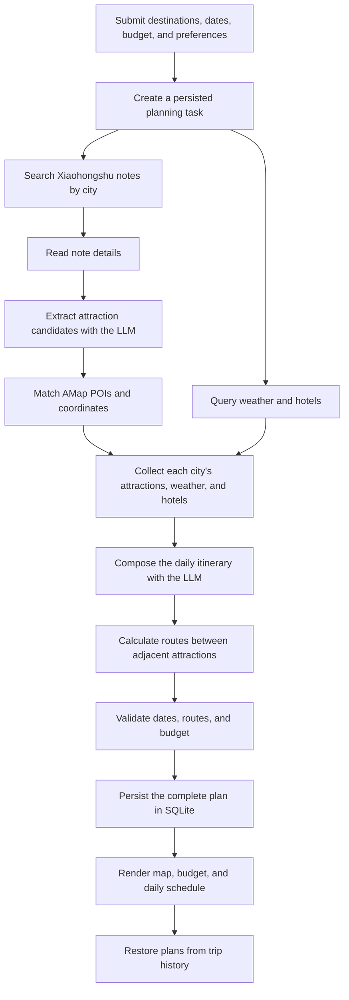
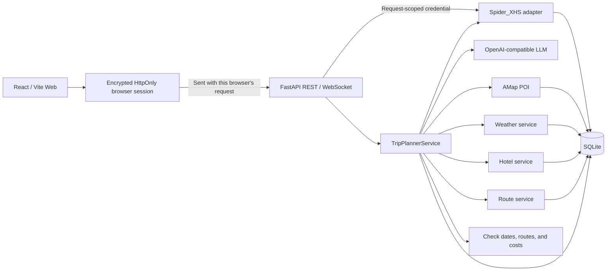

# TravelMind-AI

[](https://github.com/RichardLitt/standard-readme)
[](https://www.python.org/)
[](https://fastapi.tiangolo.com/)
[](https://react.dev/)
[](LICENSE)

> Plan multi-day trips using Xiaohongshu travel notes, maps, weather, and hotel information.

[中文](README.md) | [English](README_en.md) | [日本語](README_ja.md)

TravelMind-AI is a travel-planning app. Enter your destination, dates, budget, and preferences.
The app searches Xiaohongshu travel notes, collects place, weather, hotel, and route information
from AMap, and arranges daily visits, meals, and stays. You can view progress, daily plans, route
maps, cost estimates, and saved trips.

Core planning features are implemented. Current work focuses on realistic schedules, reliable
tasks, and checks before public release.

This project is currently intended for learning and technical evaluation. Use it in compliance
with source-platform rules, local law, and map-provider terms.

## Table of Contents

- [Background](#background)
- [Features](#features)
- [Install](#install)
- [Usage](#usage)
- [Workflow](#workflow)
- [Architecture](#architecture)
- [API](#api)
- [Configuration](#configuration)
- [Data Storage](#data-storage)
- [Project Structure](#project-structure)
- [Development and Testing](#development-and-testing)
- [Security](#security)
- [Roadmap](#roadmap)
- [Related Projects](#related-projects)
- [Maintainers](#maintainers)
- [Contributing](#contributing)
- [License](#license)

## Background

Travel plans generated only from model knowledge may contain nonexistent places, inaccurate
routes, or stale weather. TravelMind-AI builds plans in the following steps:

- Xiaohongshu supplies real travel notes and experience-based information.
- AMap supplies places, coordinates, weather, hotels, distances, and route steps.
- A large language model (LLM) finds attractions in notes and arranges daily visits and descriptions.
- Application services validate fields and dates, calculate budgets, cache provider results,
  persist tasks, and expose progress.

Xiaohongshu notes are searched when a plan is created, rather than stored in an offline knowledge base.
Map and weather numbers are never inferred by the LLM.

## Features

### Implemented

- Plan single-city trips in the Web form, or submit multi-city trips through the API.
- Search and read Xiaohongshu notes, collect attraction details, and keep source references.
- Match AMap places (POIs, or points of interest) and add addresses, coordinates, ratings, and images.
- City weather forecasts, hotel search, and SQLite-backed provider caches.
- Walking, driving, and transit routes with distance, duration, steps, and polyline coordinates.
- LLM itinerary composition for attraction order, meals, accommodation, and overall advice.
- Check that dates, cities, route start and end points, and cost totals match the plan.
- Generate plans in the background, with periodic status checks, WebSocket updates, and error codes.
- Save complete plans, daily schedules, and routes, with paginated history and plan restoration.
- Responsive React UI in Chinese, English, and Japanese with AMap and ECharts visualization.
- Cookie, QR-code, and phone login with an encrypted session isolated per browser.
- Stable authentication errors and frontend redirection to account settings.

### Current Limitations

- Xiaohongshu sessions are stored as encrypted HttpOnly client cookies, not in the server database
  or process-global state.
- Each browser has its own Xiaohongshu login session, but app user accounts are not implemented.
  Trip history is not separated by user yet.
- The Web form currently creates single-city trips. Multi-city planning is available through REST.
- Missing provider values such as hotel prices and attraction ratings remain empty.
- Cost estimates currently mainly cover stays and meals. Missing ticket and transport prices do
  not mean those items are free, and the total is not a final bill.
- The app currently runs on one FastAPI server with SQLite. Tasks cannot be shared across servers yet.

## Install

### Requirements

- Python 3.12 or newer
- [uv](https://docs.astral.sh/uv/)
- Node.js 20.19 or newer (22.19 recommended)
- npm
- Docker Engine 24 or newer and Docker Compose v2 (for container deployment)
- A Xiaohongshu account, AMap developer keys, and an OpenAI-compatible LLM key

### Backend

```bash
uv sync
cp .env.example .env
```

### Xiaohongshu signing runtime

```bash
cd vendor/spider_xhs
npm install
cd ../..
```

### Web client

```bash
cd ui
npm install
cp .env.example .env
cd ..
```

Fill in the root `.env` and `ui/.env` after installation. Never commit real credentials.

### Docker Compose deployment

Container deployment reads all configuration from the root `.env` and exposes the frontend and
backend through one Nginx entry point:

```bash
cp .env.example .env
docker compose up -d --build
```

Before starting, set at least `TRAVELMIND_SESSION_SECRET`, `LLM_API_KEY`,
`AMAP_API_KEY`, `VITE_AMAP_JS_KEY`, and `VITE_AMAP_SECURITY_CODE`. Xiaohongshu cookies are no
longer configured in `.env`; each browser signs in independently after startup.

| Surface | Default URL |
| --- | --- |
| Web application | `http://127.0.0.1:8081` |
| Trip planner | `http://127.0.0.1:8081/plan` |
| Trip history | `http://127.0.0.1:8081/library` |
| Account settings | `http://127.0.0.1:8081/settings` |
| OpenAPI documentation | `http://127.0.0.1:8081/docs` |

Common operations:

```bash
docker compose ps
docker compose logs -f
docker compose down
```

`docker compose down` preserves SQLite data in the `travelmind-ai-data` named volume. Use
`docker compose down -v` only when the trip history, caches, and collected content must also be
deleted.

`VITE_AMAP_JS_KEY` and `VITE_AMAP_SECURITY_CODE` are frontend build arguments, so changing them
requires rebuilding the frontend image. Keep `TRAVELMIND_SESSION_SECRET` stable across restarts and
instances or existing encrypted browser sessions become invalid. QR and phone challenges remain
five-minute process-local state, so the current image runs one Uvicorn worker; successful sessions
are stored only in the corresponding browser.

## Usage

Start FastAPI in one terminal:

```bash
uv run uvicorn main:app --reload --host 127.0.0.1 --port 8000
```

Start the React client in another terminal:

```bash
cd ui
npm run dev
```

| Surface | Default URL |
| --- | --- |
| Web application | `http://127.0.0.1:5173` |
| Trip planner | `http://127.0.0.1:5173/plan` |
| Trip history | `http://127.0.0.1:5173/library` |
| Account settings | `http://127.0.0.1:5173/settings` |
| OpenAPI documentation | `http://127.0.0.1:8000/docs` |

Vite selects another port when `5173` is occupied. Use the URL printed in the terminal.

### Create a trip

```bash
curl -X POST http://127.0.0.1:8000/api/trip/plan \
  -H 'Content-Type: application/json' \
  -d '{
    "city": "Shenzhen",
    "start_date": "2026-10-01",
    "end_date": "2026-10-03",
    "transportation": "transit",
    "accommodation": "comfortable hotel",
    "preferences": ["food", "urban walks"],
    "free_text_input": "Keep the pace relaxed",
    "language": "en",
    "note_limit": 4,
    "travelers": 2,
    "total_budget": 6000,
    "hotel_budget_max": 900
  }'
```

The endpoint returns `202 Accepted`, a `task_id`, a polling URL, and a WebSocket URL. Query the
task until it reaches `completed` or `failed`:

```bash
curl http://127.0.0.1:8000/api/trip/status/9fd32f0d4f38464d8ca7100af700f21a
```

A successful `result` contains the complete plan. A failed task contains a stable `error_code`
and a client-safe message.

Trip submission and live Xiaohongshu endpoints require the current client to be signed in. The Web
application sends its HttpOnly cookie automatically. CLI clients must retain the login response
cookie and reuse the same cookie jar for later requests.

For a multi-city request, use `cities` instead of `city`. The sum of city days must match the
inclusive date range:

```json
{
  "cities": [
    { "city": "Shanghai", "days": 2 },
    { "city": "Suzhou", "days": 2 }
  ],
  "start_date": "2026-10-01",
  "end_date": "2026-10-04"
}
```

## Workflow



The submission endpoint returns immediately. FastAPI runs the planner as a background task. The
Web client currently polls the status endpoint, while the backend also exposes WebSocket updates.
Saved tasks and plans can still be viewed after a service restart, but unfinished planning tasks
are not automatically resumed.

## Architecture



The raw Xiaohongshu Cookie exists only while validating a login or serving the current business
request. The browser stores an authenticated encrypted token, and the server keeps no shared user
Cookie. QR and phone challenges retain only five-minute, non-persistent task state.

| Layer | Directory | Responsibility |
| --- | --- | --- |
| API | `app/routers`, `app/schemas` | HTTP/WebSocket, validation, REST models, errors |
| Data structures | `app/models` | Define the fields for trips, attractions, hotels, weather, and routes |
| App logic | `app/services` | Read notes, query information, plan days, check results, update progress |
| Integration | `app/integrations` | Xiaohongshu, LLM, and AMap adapters |
| Storage | `app/storage` | SQLite schemas, caches, complete plans, transactions |
| Web | `ui/src` | Routing, views, components, Zustand state, Axios requests |

API request and response formats are kept separate from internal data structures. Results from
Xiaohongshu, AMap, and other services are converted into a common format before planning or display.

## API

### Trip planning

| Method | Path | Purpose |
| --- | --- | --- |
| `POST` | `/api/trip/plan` | Submit a complete planning task |
| `GET` | `/api/trip/status/{task_id}` | Read progress and the final result |
| `WS` | `/api/trip/ws/{task_id}` | Subscribe to status changes |
| `GET` | `/api/trip/history` | List completed-plan summaries by page |
| `GET` | `/api/trip/plan/{plan_id}` | Restore a complete plan |

The trip-history endpoint accepts `page` (default `1`) and `page_size` (default `8`, maximum `20`)
query parameters. Its response includes `total` and `total_pages` for client-side pagination.

### Xiaohongshu content

| Method | Path | Purpose |
| --- | --- | --- |
| `GET` | `/api/xhs/health` | Check content-client prerequisites |
| `POST` | `/api/xhs/search` | Search travel notes |
| `GET` | `/api/xhs/notes/{note_id}` | Read a note |
| `POST` | `/api/xhs/attractions` | Search notes, extract attractions, and enrich POIs |
| `GET` | `/api/xhs/attractions/{extraction_id}` | Restore an extraction result |

### Places, weather, hotels, and routes

| Method | Path | Purpose |
| --- | --- | --- |
| `GET` | `/api/poi/search` | Search normalized POIs |
| `GET` | `/api/poi/detail/{poi_id}` | Read POI details |
| `GET` | `/api/poi/photo` | Find and cache attraction photos |
| `GET` | `/api/map/poi` | TripStar-compatible POI search |
| `GET` | `/api/weather` | Query weather by city and date |
| `GET` | `/api/map/weather` | TripStar-compatible weather endpoint |
| `GET` | `/api/hotels/search` | Search hotels by preference, budget, and area |
| `POST` | `/api/map/route` | Calculate a route between two points |

The route endpoint calculates distance, duration, and navigation steps for known
endpoints. The itinerary planner decides attraction order.

### Xiaohongshu client login

These endpoints are public and do not require a management key. A successful login issues an
encrypted HttpOnly cookie only to the current browser. QR-code and phone challenges expire after
five minutes. Each client can create up to eight login tasks per 60 seconds, and the server retains
at most 12 tasks at once.

| Method | Path | Purpose |
| --- | --- | --- |
| `GET` | `/api/xhs/login/methods` | List login methods |
| `POST` | `/api/xhs/login/qrcode/start` | Start QR login |
| `GET` | `/api/xhs/login/{login_id}/qrcode` | Read the QR code |
| `GET` | `/api/xhs/login/{login_id}/status` | Read status and claim the login result |
| `POST` | `/api/xhs/login/phone/start` | Send a phone verification code |
| `POST` | `/api/xhs/login/phone/verify` | Verify the SMS code |
| `POST` | `/api/xhs/login/cookie` | Validate a Cookie and establish a browser session |
| `DELETE` | `/api/xhs/login/session` | Clear this browser's Xiaohongshu session |

## Configuration

### Backend `.env`

| Variable | Required | Default | Purpose |
| --- | --- | --- | --- |
| `TRAVELMIND_SESSION_SECRET` | Yes | none | Encrypt browser sessions; use at least 32 random characters |
| `LLM_API_KEY` | Yes | none | OpenAI-compatible API key |
| `LLM_BASE_URL` | No | `https://api.openai.com/v1` | Chat Completions base URL |
| `LLM_MODEL_ID` | No | `gpt-4o-mini` | Extraction and planning model |
| `LLM_TIMEOUT` | No | `180` | Request timeout in seconds |
| `LLM_ENABLE_THINKING` | No | `false` | Thinking mode for compatible DashScope models |
| `AMAP_API_KEY` | Yes | none | AMap Web Service key for place, weather, hotel, and route queries |
| `TRAVELMIND_DATA_DIR` | No | `./data` | SQLite data directory |
| `WEATHER_CACHE_TTL_SECONDS` | No | `10800` | Weather cache TTL |
| `HOTEL_CACHE_TTL_SECONDS` | No | `86400` | Hotel cache TTL |
| `ROUTE_CACHE_TTL_SECONDS` | No | `86400` | Route cache TTL |

Compatibility aliases exist for earlier deployments. New deployments should use the primary
variables shown above.

### Frontend `ui/.env`

```dotenv
VITE_AMAP_JS_KEY=your_web_js_key
VITE_AMAP_SECURITY_CODE=your_security_code
```

An AMap Web Service key and Web JS key are different credentials. Frontend variables are shipped
to the browser; configure domain restrictions and a security code in the AMap console, and never
put a backend service key in a `VITE_*` variable.

## Data Storage

The default deployment uses one SQLite database:

```text
data/travelmind.db
```

`travelmind.db-wal` and `travelmind.db-shm` are SQLite WAL support files, not separate databases.
The database stores Xiaohongshu content and extractions, provider caches, planning requests, task
states, complete plan JSON, daily schedules, and route segments.

Zustand only caches the current form and most recently viewed plan in the browser. Trip history
always uses `/api/trip/history` and `/api/trip/plan/{plan_id}` to restore data from SQLite.
Xiaohongshu sessions are not stored in SQLite; the server decrypts one only for the current request
or its running planning task.

## Project Structure

```text
TravelMind-AI/
├── app/
│   ├── integrations/       # Xiaohongshu, LLM, and AMap adapters
│   ├── models/             # Trip, attraction, hotel, weather, and route data structures
│   ├── routers/            # REST and WebSocket routes
│   ├── schemas/            # Independent API request/response models
│   ├── services/           # Business services and complete trip planning
│   ├── storage/            # SQLite repositories and caches
│   └── xhs_session.py      # Browser-session encryption and cookie delivery
├── data/                   # Local runtime data
├── tests/                  # unittest test suite
├── ui/                     # React / Vite Web application
│   ├── Dockerfile          # Frontend build and Nginx runtime image
│   └── nginx.conf          # SPA, API, and WebSocket reverse proxy
├── vendor/spider_xhs/      # Xiaohongshu PC client runtime
├── .dockerignore           # Backend image build exclusions
├── .env.example            # Backend configuration template
├── compose.yaml            # Services, network, and persistent volume
├── Dockerfile              # FastAPI and signing runtime image
├── LICENSE                 # MIT License
├── main.py                 # FastAPI entry point
├── pyproject.toml          # Python metadata and dependencies
└── TODO.md                 # Roadmap and acceptance items
```

## Development and Testing

```bash
uv run python -m unittest discover -s tests -v

cd ui
npm run lint
npm run build
```

Before committing:

```bash
git diff --check
```

Automated tests use fake providers and should not depend on real cookies, networks, or paid APIs.
Run full-flow checks with real services separately and keep secrets out of logs and test output.

## Security

- Never commit `.env`, databases, cookies, session secrets, API keys, or private logs.
- Raw Xiaohongshu cookies are never returned in response bodies or stored in SQLite, logs, Zustand,
  or `localStorage`.
- A successful login issues a seven-day encrypted HttpOnly cookie isolated to that browser.
- Use at least 32 random characters for `TRAVELMIND_SESSION_SECRET`; never reuse another API key.
- Signing out clears only the current browser session. The server cannot force one browser to sign
  out yet; changing the session secret requires every browser to sign in again.
- API responses, business tables, and logs must not contain cookies, `xsec_token`, Authorization,
  or complete prompts.
- Public login creation is rate- and capacity-limited, but it is not a complete user identity system.
- Enable HTTPS and add user authentication, trusted-proxy configuration, centralized rate limits,
  secret management, and auditing before an Internet-facing deployment.

## Roadmap

- Check daily visit and travel time, attraction distances, and hotel areas; clarify cost estimates.
- Prevent duplicate tasks and support retries, restart recovery, progress after page refresh, and cancellation.
- Add app user accounts so each user can access only their own trips.
- Add itinerary editing, history management, multi-city forms, saved favorites, and image failure states.

See [TODO.md](TODO.md) for real-service checks, HTTPS, monitoring, backups, and other release work.

## Related Projects

- [Spider_XHS](https://github.com/cv-cat/Spider_XHS) for Xiaohongshu PC signing and login references.
- [TripStar](https://github.com/1sdv/TripStar) for travel-planning workflows and compatible endpoints.
- [Standard Readme](https://github.com/RichardLitt/standard-readme) for this document structure.

TravelMind-AI maintains its own implementation, models, and persistence. Review the licenses and
terms of referenced projects separately.

## Maintainers

- wen.yao

## Contributing

Issues and pull requests are welcome. Before submitting a change:

1. Create a focused branch from the latest main branch.
2. Keep API formats, internal data structures, and external service calls separate.
3. Add tests for new rules, errors, and persistence behavior.
4. Run backend tests, frontend linting, and a production build.
5. Confirm the change contains no `.env`, database, cookie, key, log, or personal data.

## License

This project is licensed under the [MIT License](LICENSE). You may use, copy, modify, merge,
publish, distribute, sublicense, or sell the software provided that the copyright and license
notices are retained.

Third-party code referenced by or included in this project remains subject to its own license and
terms of use.
