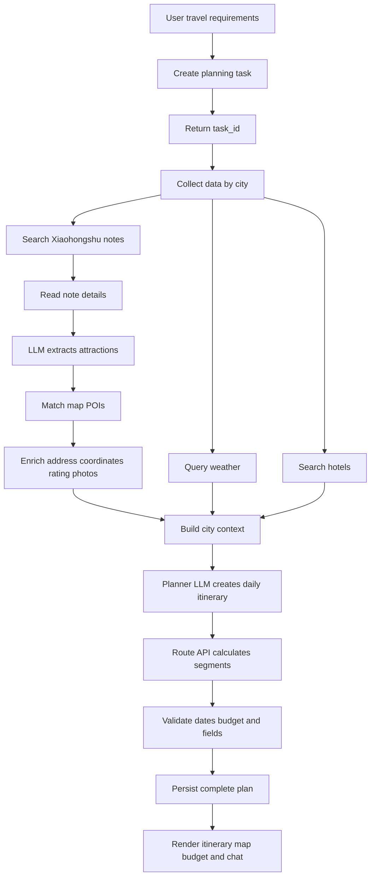
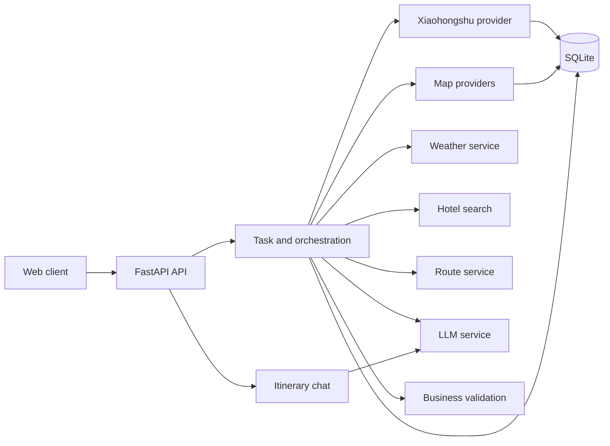

# TravelMind-AI

> An AI-powered personalized travel planning system

[中文](README.md) | [English](README_en.md) | [日本語](README_ja.md)

TravelMind-AI turns a user's destination, dates, interests, transportation and accommodation
preferences into an executable multi-day itinerary. It combines authentic Xiaohongshu travel
notes, LLM extraction, map POI facts, weather, hotels and route calculations.

The architecture keeps responsibilities explicit: the LLM understands preferences, extracts
content and plans an itinerary; external providers supply verifiable facts; application services
validate, cache, persist and expose task progress.

## Features

- Personalized single-city and multi-city itineraries.
- Xiaohongshu note search, detail retrieval, attraction extraction and real-life photos.
- POI enrichment with provider ID, address, coordinates, phone and rating.
- Weather forecasts by city and travel date.
- Hotel search based on accommodation preference, budget and attraction area.
- Walking, driving and transit route calculations between itinerary locations.
- Daily attractions, meals, hotels, reservation reminders and practical suggestions.
- Budget totals for tickets, hotels, meals, local transport and inter-city transport.
- Interactive map, itinerary knowledge graph and context-aware itinerary chat.
- Optional user preference memory and persisted itinerary history.

## End-to-end workflow



The planner LLM decides the itinerary structure and visit order. Map APIs calculate factual
distances, durations and route steps. Weather facts come from a weather provider, and hotel
facts come from map search. Missing external data remains empty instead of being invented.

## Architecture



| Directory | Responsibility |
| --- | --- |
| `app/routers` | HTTP and WebSocket endpoints, request validation and errors |
| `app/schemas` | API request and response models |
| `app/models` | Domain models for POIs, plans, weather, hotels and routes |
| `app/services` | Business orchestration, extraction, enrichment and validation |
| `app/integrations` | Xiaohongshu, LLM, AMap and Google adapters |
| `app/storage` | SQLite schemas, caches, history and transactions |
| `vendor/spider_xhs` | Vendored Xiaohongshu PC signing client |

## API contract

### Trip planning

```text
POST /api/trip/plan
GET  /api/trip/status/{task_id}
WS   /api/trip/ws/{task_id}
GET  /api/trip/history
GET  /api/trip/plan/{plan_id}
```

The plan request contains cities, dates, stay durations, transportation, accommodation,
preferences and free-form requirements. Submission returns a `task_id`; completion returns a
validated `TripPlan` containing daily plans, attractions, meals, hotels, weather, routes and budget.

### Xiaohongshu

```text
GET  /api/xhs/health
POST /api/xhs/search
GET  /api/xhs/notes/{note_id}
POST /api/xhs/attractions
GET  /api/xhs/attractions/{extraction_id}
```

The Web client also supports the three Spider_XHS PC login methods:

```text
GET  /api/xhs/login/methods
POST /api/xhs/login/qrcode/start
GET  /api/xhs/login/{login_id}/qrcode
GET  /api/xhs/login/{login_id}/status
POST /api/xhs/login/phone/start
POST /api/xhs/login/phone/verify
POST /api/xhs/login/cookie
```

QR-code and phone login use a short-lived asynchronous task. The browser polls the status with
`login_id`; after success the session is kept only in the current service process and is never
returned to the browser, logged or persisted. A Cookie in `TRAVELMIND_XHS_COOKIE` is optional and
is used after a service restart when no Web login session exists.

`POST /api/xhs/attractions` is the attraction data entry point:

```text
Search notes -> read details -> LLM extraction -> POI matching -> SQLite persistence
```

### POI, weather and routes

```text
GET  /api/poi/search?keywords=Palace%20Museum&city=Beijing
GET  /api/poi/detail/{poi_id}
GET  /api/poi/photo?name=Palace%20Museum&city=Beijing
GET  /api/map/poi?keywords=Palace%20Museum&city=Beijing
GET  /api/weather?city=Beijing&start_date=2026-08-28&end_date=2026-08-30
GET  /api/map/weather?city=Beijing
POST /api/map/route
```

Weather queries accept optional `start_date` and `end_date` parameters. Only dates covered by the
provider are returned. Results are cached by provider, city and forecast date for three hours by default.

### Chat and preference memory

```text
POST   /api/chat/ask
GET    /api/memory/list
POST   /api/memory/add-explicit
DELETE /api/memory/item
DELETE /api/memory/clear
```

## Data and persistence

The main domain objects are `TripRequest`, `TripPlan`, `DayPlan`, `Attraction`, `Hotel`,
`WeatherInfo`, `RouteSegment` and `Budget`. Provider responses are normalized before entering
the planner. Numeric fields contain numbers only; units and arithmetic expressions are kept out
of numeric fields.

## Project structure

```text
TravelMind-AI/
├── app/integrations/       # Xiaohongshu, LLM, AMap and Google adapters
├── app/models/             # Domain objects
├── app/routers/            # HTTP and WebSocket routes
├── app/schemas/            # API input and output models
├── app/services/           # Business workflows and orchestration
├── app/storage/            # SQLite persistence and caches
├── vendor/spider_xhs/      # Xiaohongshu PC signing client
├── data/                   # Local SQLite data directory
├── main.py                 # FastAPI entry point
├── pyproject.toml          # Project metadata and dependencies
└── TODO.md                # Implementation and acceptance checklist
```

Dependencies flow from routers to services, then to providers and storage. Providers do not
depend on routes, so a map or LLM provider can be replaced without changing API contracts.

The default database is `data/travelmind.db`. `TRAVELMIND_DATA_DIR` can select another directory.
The database stores Xiaohongshu notes, extraction results, POIs, image URLs, weather/hotel/route
caches, tasks, plans and history. Authentication fields, cookies, tokens, API keys and complete
request headers are filtered before persistence.

## Configuration

```bash
cp .env.example .env
```

```dotenv
TRAVELMIND_XHS_COOKIE=replace_me
LLM_API_KEY=replace_me
LLM_BASE_URL=https://api.openai.com/v1
LLM_MODEL_ID=gpt-4o-mini
LLM_TIMEOUT=180
LLM_ENABLE_THINKING=false
AMAP_API_KEY=replace_me
WEATHER_CACHE_TTL_SECONDS=10800
# TRAVELMIND_DATA_DIR=/absolute/path/travelmind-data
```

Compatible aliases are `XHS_COOKIE`/`COOKIES`, `OPENAI_API_KEY`/`OPENAI_BASE_URL`, and
`AMAP_MAPS_API_KEY`/`VITE_AMAP_WEB_KEY`. The backend AMap Web Service key is different from a
frontend JavaScript key and must not be mixed.

## Local development

Requirements: Python 3.12+, Node.js 20 and `uv`. The Xiaohongshu PC signing runtime also needs
its local Node dependency:

```bash
cd vendor/spider_xhs
npm install
cd ../..
```

```bash
uv sync
cp .env.example .env
uv run uvicorn main:app --reload
```

Open the API documentation at `http://127.0.0.1:8000/docs`.

```bash
PYTHONDONTWRITEBYTECODE=1 .venv/bin/python -m compileall -q app main.py
UV_CACHE_DIR=/tmp/travelmind-uv-cache uv lock --check
```

Use fake providers for provider, cache, persistence, fallback and error tests before making live
requests. Detailed implementation tasks and acceptance criteria are maintained in [TODO.md](TODO.md).

Errors are classified as configuration, authentication, provider network, LLM parsing, validation
or persistence errors. Logs include time, level, task ID, city, business action and result count,
but never full note text, cookies, tokens, API keys or complete prompts.

## Security

- Keep real cookies and API keys in `.env` or a secure runtime configuration.
- Never return cookies, `xsec_token`, Authorization headers or API keys from an API.
- Never persist credentials, complete request headers or full LLM prompts.
- Convert provider errors into stable business errors before returning them to clients.
- Do not return a partially validated itinerary after a task failure.
- Enable preference memory only with user authorization and provide deletion operations.
