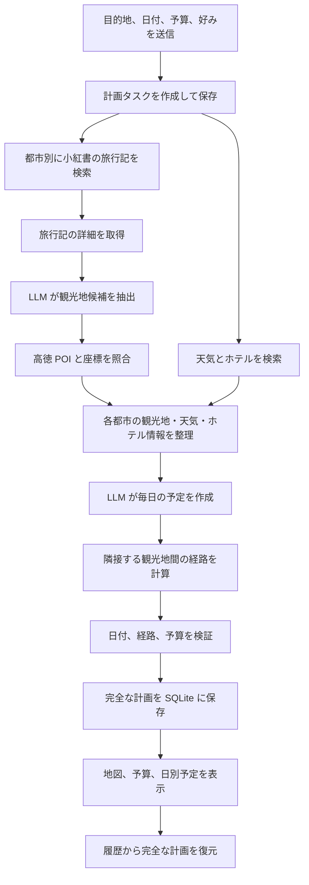
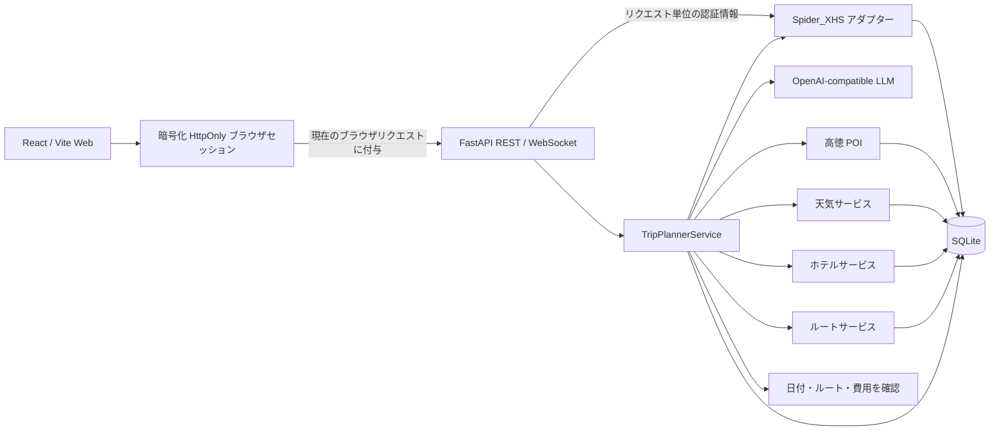

# TravelMind-AI

[](https://github.com/RichardLitt/standard-readme)
[](https://www.python.org/)
[](https://fastapi.tiangolo.com/)
[](https://react.dev/)
[](LICENSE)

> 小紅書の旅行記と地図・天気・ホテル情報を参考に、数日間の旅行プランを作成します。

[中文](README.md) | [English](README_en.md) | [日本語](README_ja.md)

TravelMind-AI は旅行プランを作るアプリです。目的地、日付、予算、好みを入力すると、
小紅書の旅行記から観光地を探し、高徳地図で場所・天気・ホテル・ルートを調べます。
その情報をもとに、毎日の観光、食事、宿泊を提案します。画面では作成の進み具合、日別予定、
ルート地図、費用の目安、保存した旅行プランを確認できます。

基本的な旅行プラン作成機能は実装済みです。現在は無理のない日程、安定した処理、公開前の確認を進めています。

本プロジェクトは現在、学習と技術検証を目的としています。データ提供元の規約、地域の法令、
地図サービスの利用規約を守って使用してください。

## 目次

- [背景](#背景)
- [機能](#機能)
- [インストール](#インストール)
- [使い方](#使い方)
- [業務フロー](#業務フロー)
- [アーキテクチャ](#アーキテクチャ)
- [API](#api)
- [設定](#設定)
- [データ保存](#データ保存)
- [プロジェクト構成](#プロジェクト構成)
- [開発とテスト](#開発とテスト)
- [セキュリティ](#セキュリティ)
- [ロードマップ](#ロードマップ)
- [関連プロジェクト](#関連プロジェクト)
- [メンテナー](#メンテナー)
- [コントリビューション](#コントリビューション)
- [ライセンス](#ライセンス)

## 背景

モデルの知識だけで生成した旅行計画には、存在しない場所、不正確な経路、古い天気情報が
含まれることがあります。TravelMind-AI は次の手順で情報を整理します。

- 小紅書は実際の旅行記と体験情報を提供します。
- 高徳地図は場所、座標、天気、ホテル、距離、経路手順を提供します。
- 大規模言語モデル（LLM）が旅行記から観光地を整理し、毎日の順序と説明を作成します。
- プログラムが日付、都市、ルート、費用合計を確認し、検索結果や作成状況、旅行プランを保存します。

小紅書の旅行記はプラン作成時に検索します。事前にオフラインの知識データベースは作成しません。
地図と天気の数値を LLM が推測して生成することもありません。

## 機能

### 実装済み

- Web フォームで 1 都市の旅行を計画でき、API では複数都市にも対応。
- 小紅書の旅行記検索、詳細取得、観光地の構造化抽出、出典記録。
- 高徳地図の地点情報（POI）を検索し、住所、座標、評価、画像を追加。
- 都市別天気予報、ホテル検索、SQLite キャッシュ。
- 徒歩、車、公共交通の距離、所要時間、手順、折れ線座標。
- 毎日の観光地の順序、食事、宿泊、出発前のアドバイスを作成。
- 日付、都市、ルートの出発地・目的地、費用合計の一致を確認。
- バックグラウンドでプランを作成し、定期的な進捗確認、WebSocket 通知、エラー表示に対応。
- 旅行プラン、日別予定、ルートを保存し、履歴のページ表示と再閲覧に対応。
- 中国語・英語・日本語に対応する React 画面、高徳地図、ECharts 予算表示。
- Cookie、QR コード、電話番号ログインと、ブラウザごとに分離された暗号化セッション。
- 認証切れ時の安定したエラーとアカウント管理画面への誘導。

### 現在の制限

- 小紅書のログイン状態は暗号化された HttpOnly Cookie としてクライアントに保存され、
  サーバーの DB やプロセス共有状態には保存されません。
- 小紅書のログイン状態はブラウザごとに保存されますが、アプリの一般ユーザーアカウントは
  未実装です。旅行履歴もユーザーごとには分かれていません。
- Web フォームは現在単一都市向けです。複数都市は REST API から利用できます。
- Provider が返さないホテル価格や評価は空のまま保持し、モデルで補完しません。
- 費用の目安は現在、主に宿泊と食事を集計しています。入場料や交通費が不明でも無料とは
  限りません。合計は最終的な支払額ではありません。
- 現在は 1 台の FastAPI サーバーと SQLite で動作し、複数サーバーでのタスク共有には未対応です。

## インストール

### 必要環境

- Python 3.12 以上
- [uv](https://docs.astral.sh/uv/)
- Node.js 20.19 以上（22.19 推奨）
- npm
- Docker Engine 24 以上と Docker Compose v2（コンテナで実行する場合）
- 小紅書アカウント、高徳開発者 Key、OpenAI-compatible LLM Key

### バックエンド

```bash
uv sync
cp .env.example .env
```

### 小紅書署名ランタイム

```bash
cd vendor/spider_xhs
npm install
cd ../..
```

### Web フロントエンド

```bash
cd ui
npm install
cp .env.example .env
cd ..
```

インストール後、ルートの `.env` と `ui/.env` を設定します。実際の認証情報を Git に
コミットしないでください。

### Docker Compose デプロイ

コンテナ環境ではルートの `.env` だけを設定し、フロントエンドとバックエンドを 1 つの
Nginx エントリーポイントから利用します。

```bash
cp .env.example .env
docker compose up -d --build
```

起動前に `TRAVELMIND_SESSION_SECRET`、`LLM_API_KEY`、
`AMAP_API_KEY`、`VITE_AMAP_JS_KEY`、`VITE_AMAP_SECURITY_CODE` を設定してください。
小紅書 Cookie は `.env` に保存せず、起動後に各ブラウザで個別にログインします。

| 画面 | 既定 URL |
| --- | --- |
| Web アプリ | `http://127.0.0.1:8081` |
| 旅行計画 | `http://127.0.0.1:8081/plan` |
| 旅行履歴 | `http://127.0.0.1:8081/library` |
| アカウント設定 | `http://127.0.0.1:8081/settings` |
| OpenAPI | `http://127.0.0.1:8081/docs` |

主な運用コマンド：

```bash
docker compose ps
docker compose logs -f
docker compose down
```

`docker compose down` を実行しても、SQLite データを保存する名前付きボリューム
`travelmind-ai-data` は残ります。旅行履歴、キャッシュ、取得済みコンテンツも削除する場合だけ
`docker compose down -v` を使用してください。

`VITE_AMAP_JS_KEY` と `VITE_AMAP_SECURITY_CODE` はフロントエンドのビルド引数です。変更後は
フロントエンドイメージを再ビルドしてください。`TRAVELMIND_SESSION_SECRET` は再起動時や
複数インスタンス間で同じ値を維持しないと、既存のブラウザセッションが無効になります。
QR・電話ログインのチャレンジは 5 分間のプロセス内一時状態なので、現在は Uvicorn Worker を
1 つに固定しています。ログイン成功後のセッションは対応するブラウザだけに保存されます。

## 使い方

1 つ目のターミナルで FastAPI を起動します。

```bash
uv run uvicorn main:app --reload --host 127.0.0.1 --port 8000
```

2 つ目のターミナルで React を起動します。

```bash
cd ui
npm run dev
```

| 画面 | 既定 URL |
| --- | --- |
| Web アプリ | `http://127.0.0.1:5173` |
| 旅行計画 | `http://127.0.0.1:5173/plan` |
| 旅行履歴 | `http://127.0.0.1:5173/library` |
| アカウント設定 | `http://127.0.0.1:5173/settings` |
| OpenAPI | `http://127.0.0.1:8000/docs` |

`5173` が使用中の場合、Vite は別のポートを選択します。ターミナル出力を確認してください。

### 旅行計画を作成する

```bash
curl -X POST http://127.0.0.1:8000/api/trip/plan \
  -H 'Content-Type: application/json' \
  -d '{
    "city": "東京",
    "start_date": "2026-10-01",
    "end_date": "2026-10-03",
    "transportation": "transit",
    "accommodation": "快適なホテル",
    "preferences": ["グルメ", "街歩き"],
    "free_text_input": "ゆったりした日程にする",
    "language": "ja",
    "note_limit": 4,
    "travelers": 2,
    "total_budget": 6000,
    "hotel_budget_max": 900
  }'
```

`202 Accepted` と `task_id`、ポーリング URL、WebSocket URL が返ります。タスク状態は
`submitted`、`processing`、`completed`、`failed` のいずれかです。成功時の `result` は
完全な計画、失敗時は安定した `error_code` とクライアント向けメッセージを含みます。

完全な旅行計画とリアルタイム小紅書 API は、現在のクライアントでのログインが必要です。
Web 画面は HttpOnly Cookie を自動送信します。CLI はログイン応答の Cookie を保存し、以後の
リクエストで同じ Cookie Jar を使用してください。

複数都市では `city` の代わりに `cities` を使います。各都市の日数合計は開始日から終了日までの
日数と一致する必要があります。

```json
{
  "cities": [
    { "city": "東京", "days": 2 },
    { "city": "鎌倉", "days": 2 }
  ],
  "start_date": "2026-10-01",
  "end_date": "2026-10-04"
}
```

## 業務フロー



送信 API はすぐに `task_id` を返し、FastAPI のバックグラウンドタスクが計画を実行します。
Web 画面は定期的に進捗を確認し、バックエンドは WebSocket も提供します。SQLite に
保存した作成状況と旅行プランは再起動後も取得できますが、未完了の作成処理は自動では再開しません。

## アーキテクチャ



小紅書の生 Cookie は、ログイン検証中または現在の業務リクエスト中だけ一時的に存在します。
ブラウザは認証付き暗号文を保存し、サーバーはユーザー間で共有される Cookie を保持しません。
QR・電話ログインのタスクはメモリに 5 分間だけ保存します。

| レイヤー | ディレクトリ | 責務 |
| --- | --- | --- |
| API | `app/routers`、`app/schemas` | HTTP/WebSocket、入力検証、REST モデル、エラー |
| データ構造 | `app/models` | 旅行、観光地、ホテル、天気、ルートに必要な項目を定義 |
| アプリ処理 | `app/services` | 旅行記整理、情報検索、日程作成、結果確認、進捗更新 |
| 連携 | `app/integrations` | 小紅書、LLM、高徳アダプター |
| 保存 | `app/storage` | SQLite、キャッシュ、完全な計画、トランザクション |
| Web | `ui/src` | ルーティング、画面、コンポーネント、Zustand、Axios |

API の入出力形式と内部のデータ構造は分けて管理します。小紅書や高徳地図などの検索結果は、
共通の形式に整理してからプラン作成や画面表示に使います。

## API

### 完全な旅行計画

| メソッド | パス | 用途 |
| --- | --- | --- |
| `POST` | `/api/trip/plan` | 計画タスクを送信 |
| `GET` | `/api/trip/status/{task_id}` | 進捗と最終結果を取得 |
| `WS` | `/api/trip/ws/{task_id}` | 状態変化を購読 |
| `GET` | `/api/trip/history` | 完了した計画をページ単位で取得 |
| `GET` | `/api/trip/plan/{plan_id}` | 完全な計画を復元 |

旅行履歴 API はクエリパラメータ `page`（既定値 `1`）と `page_size`（既定値 `8`、最大 `20`）を
受け取ります。レスポンスにはページ表示用の `total` と `total_pages` も含まれます。

### 小紅書コンテンツ

| メソッド | パス | 用途 |
| --- | --- | --- |
| `GET` | `/api/xhs/health` | コンテンツクライアントの実行条件を確認 |
| `POST` | `/api/xhs/search` | 旅行記を検索 |
| `GET` | `/api/xhs/notes/{note_id}` | 旅行記の詳細を取得 |
| `POST` | `/api/xhs/attractions` | 旅行記検索、観光地抽出、POI 補完 |
| `GET` | `/api/xhs/attractions/{extraction_id}` | 抽出結果を復元 |

### 地図情報

| メソッド | パス | 用途 |
| --- | --- | --- |
| `GET` | `/api/poi/search` | 標準化 POI を検索 |
| `GET` | `/api/poi/detail/{poi_id}` | POI 詳細を取得 |
| `GET` | `/api/poi/photo` | 観光地画像を検索してキャッシュ |
| `GET` | `/api/map/poi` | TripStar 互換 POI 検索 |
| `GET` | `/api/weather` | 都市と日付で天気を検索 |
| `GET` | `/api/map/weather` | TripStar 互換天気 API |
| `GET` | `/api/hotels/search` | 好み、予算、地域でホテルを検索 |
| `POST` | `/api/map/route` | 2 地点間のルートを計算 |

ルート API は確定した起点と終点の距離、所要時間、案内手順だけを計算します。観光地の
訪問順序は旅程 Planner が決定します。

### 小紅書クライアントログイン

以下の API は公開され、管理 Key は不要です。ログインに成功すると、暗号化された HttpOnly
Cookie が現在のブラウザにだけ発行されます。QR コードと電話番号のログインタスクは 5 分で
期限切れになります。クライアントごとの作成上限は 60 秒あたり 8 件、サーバー全体では同時に
12 件までです。

| メソッド | パス | 用途 |
| --- | --- | --- |
| `GET` | `/api/xhs/login/methods` | ログイン方式を取得 |
| `POST` | `/api/xhs/login/qrcode/start` | QR ログインを開始 |
| `GET` | `/api/xhs/login/{login_id}/qrcode` | QR コードを取得 |
| `GET` | `/api/xhs/login/{login_id}/status` | 状態を取得してログイン結果を受け取る |
| `POST` | `/api/xhs/login/phone/start` | SMS コードを送信 |
| `POST` | `/api/xhs/login/phone/verify` | SMS コードを検証 |
| `POST` | `/api/xhs/login/cookie` | Cookie を検証してブラウザセッションを確立 |
| `DELETE` | `/api/xhs/login/session` | 現在のブラウザの小紅書ログイン状態を消去 |

## 設定

### バックエンド `.env`

| 変数 | 必須 | 既定値 | 用途 |
| --- | --- | --- | --- |
| `TRAVELMIND_SESSION_SECRET` | 必須 | なし | ブラウザセッションを暗号化する 32 文字以上のランダム値 |
| `LLM_API_KEY` | 必須 | なし | OpenAI-compatible API Key |
| `LLM_BASE_URL` | 任意 | `https://api.openai.com/v1` | Chat Completions URL |
| `LLM_MODEL_ID` | 任意 | `gpt-4o-mini` | 抽出と計画に使用するモデル |
| `LLM_TIMEOUT` | 任意 | `180` | タイムアウト秒数 |
| `LLM_ENABLE_THINKING` | 任意 | `false` | 対応する百錬モデルの思考モード |
| `AMAP_API_KEY` | 必須 | なし | バックエンド用の高徳 Web サービス Key |
| `TRAVELMIND_DATA_DIR` | 任意 | `./data` | SQLite データディレクトリ |
| `WEATHER_CACHE_TTL_SECONDS` | 任意 | `10800` | 天気キャッシュ有効期間 |
| `HOTEL_CACHE_TTL_SECONDS` | 任意 | `86400` | ホテルキャッシュ有効期間 |
| `ROUTE_CACHE_TTL_SECONDS` | 任意 | `86400` | ルートキャッシュ有効期間 |

### フロントエンド `ui/.env`

```dotenv
VITE_AMAP_JS_KEY=your_web_js_key
VITE_AMAP_SECURITY_CODE=your_security_code
```

高徳 Web サービス Key と Web JS Key は異なります。フロントエンド変数はブラウザの成果物に
含まれるため、高徳コンソールでドメイン制限とセキュリティコードを設定してください。

## データ保存

既定では 1 つの SQLite データベースを使用します。

```text
data/travelmind.db
```

`travelmind.db-wal` と `travelmind.db-shm` は WAL モードの補助ファイルであり、別のデータベース
ではありません。小紅書の旅行記と抽出、Provider キャッシュ、計画リクエスト、タスク状態、
完全な計画 JSON、日別予定、ルート区間を保存します。

Zustand はブラウザで現在のフォームと最後に表示した計画だけをキャッシュします。履歴画面は
`/api/trip/history` と `/api/trip/plan/{plan_id}` を使用して SQLite から復元します。
小紅書のログイン状態は SQLite に保存せず、現在のリクエストまたは実行中の計画タスクでのみ
一時的に復号して使用します。

## プロジェクト構成

```text
TravelMind-AI/
├── app/
│   ├── integrations/       # 小紅書、LLM、高徳アダプター
│   ├── models/             # 旅行・観光地・ホテルなどのデータ構造
│   ├── routers/            # REST と WebSocket
│   ├── schemas/            # 独立した API リクエスト/レスポンスモデル
│   ├── services/           # 情報検索と旅行プラン作成
│   ├── storage/            # SQLite リポジトリとキャッシュ
│   └── xhs_session.py      # ブラウザセッション暗号化と Cookie 交付
├── data/                   # ローカル実行データ
├── tests/                  # unittest テスト
├── ui/                     # React / Vite Web アプリ
│   ├── Dockerfile          # フロントエンドビルドと Nginx 実行イメージ
│   └── nginx.conf          # SPA、API、WebSocket のリバースプロキシ
├── vendor/spider_xhs/      # 小紅書 PC クライアントランタイム
├── .dockerignore           # バックエンドイメージの除外設定
├── .env.example            # バックエンド設定テンプレート
├── compose.yaml            # サービス、ネットワーク、永続ボリューム
├── Dockerfile              # FastAPI と署名ランタイムのイメージ
├── LICENSE                 # MIT ライセンス
├── main.py                 # FastAPI エントリーポイント
├── pyproject.toml          # Python メタデータと依存関係
└── TODO.md                 # ロードマップと受入項目
```

## 開発とテスト

```bash
uv run python -m unittest discover -s tests -v

cd ui
npm run lint
npm run build
```

コミット前に次も確認します。

```bash
git diff --check
```

自動テストは模擬の API 応答を使用し、実際の Cookie、外部ネットワーク、有料 API に依存しません。
実サービスを使った全体の動作確認は別に実行し、ログや出力に認証情報を残さないでください。

## セキュリティ

- `.env`、データベース、Cookie、セッション Key、API Key、非公開ログをコミットしないでください。
- 小紅書の生 Cookie はレスポンス本文、SQLite、ログ、Zustand、`localStorage` に保存しません。
- ログイン成功時、7 日間有効な暗号化 HttpOnly Cookie を現在のブラウザだけに発行します。
- `TRAVELMIND_SESSION_SECRET` は 32 文字以上のランダム値にし、他の API Key を再利用しないでください。
- ログアウトは現在のブラウザだけに適用されます。サーバーから特定のブラウザだけを強制的に
  ログアウトさせる機能は未対応です。セッション Key を変更すると、全ブラウザで再ログインが必要です。
- API、業務テーブル、ログに Cookie、`xsec_token`、Authorization、完全な Prompt を残さないでください。
- 公開ログインには作成頻度と同時タスク数の制限がありますが、完全なユーザー認証ではありません。
- 公開前に HTTPS、ユーザー認証、信頼済み Proxy 設定、集中レート制限、秘密情報管理、監査を追加してください。

## ロードマップ

- 1 日の観光・移動時間、観光地の距離、宿泊場所を確認し、費用の説明を改善する。
- 重複処理を防ぎ、再試行、再起動後の復旧、画面更新後の進捗確認、キャンセルに対応する。
- 一般ユーザーアカウントを追加し、自分の旅行プランだけにアクセスできるようにする。
- 旅程編集、履歴管理、複数都市フォーム、お気に入り保存、画像読み込み失敗の表示を追加する。

実サービスの動作確認、HTTPS、監視、バックアップなどは [TODO.md](TODO.md) を参照してください。

## 関連プロジェクト

- [Spider_XHS](https://github.com/cv-cat/Spider_XHS)：小紅書 PC 署名とログインの参考。
- [TripStar](https://github.com/1sdv/TripStar)：旅行計画フローと互換 API の参考。
- [Standard Readme](https://github.com/RichardLitt/standard-readme)：本文書の構成規約。

TravelMind-AI のコード、データ構造、データ保存は本プロジェクトが独立して管理します。参照元のライセンスと
利用条件は各リポジトリで確認してください。

## メンテナー

- wen.yao

## コントリビューション

Issue と Pull Request を歓迎します。変更を送る前に次を確認してください。

1. 最新の main から目的が明確なブランチを作成する。
2. API 形式、内部データ構造、外部サービス呼び出しを分けて管理する。
3. 新しいルール、エラー処理、データ保存のテストを追加する。
4. バックエンドテスト、フロントエンド Lint、production build を実行する。
5. `.env`、DB、Cookie、Key、ログ、個人情報を含めない。

## ライセンス

本プロジェクトは [MIT License](LICENSE) の下で公開されています。著作権表示とライセンス表示を
保持することを条件に、本ソフトウェアの使用、複製、変更、結合、公開、配布、再許諾、販売が可能です。

本プロジェクトが参照または同梱する第三者コードには、それぞれのライセンスと利用条件が適用されます。
