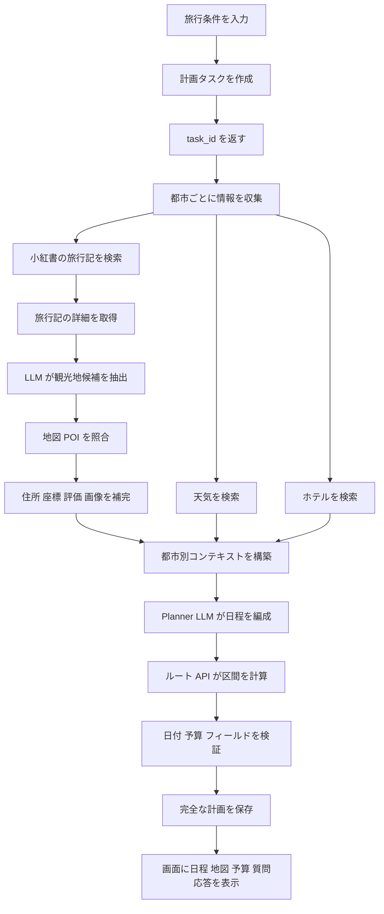
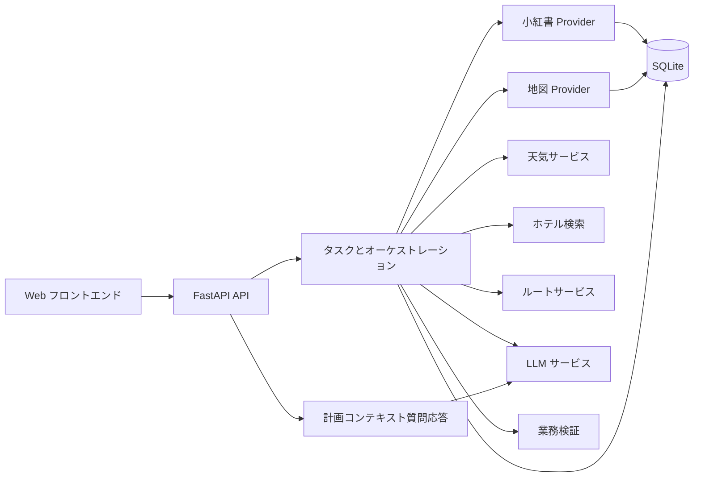

# TravelMind-AI

> AI によるパーソナライズ旅行計画システム

[中文](README.md) | [English](README_en.md) | [日本語](README_ja.md)

TravelMind-AI は、目的地、日付、滞在日数、交通手段、宿泊の希望、旅行の興味を入力すると、
実行可能な複数日程の旅行計画を作成します。小紅書の旅行記、LLM による候補抽出、地図 POI、
天気、ホテル、ルート情報を組み合わせて利用します。

責務を明確に分離しています。LLM は好みの理解、文章からの抽出、日程の編成を担当します。
外部サービスは座標、天気、距離、所要時間などの検証可能な事実を提供します。業務層は検証、
キャッシュ、永続化、タスク状態を担当します。

## 主な機能

- 都市、日付、交通、宿泊、興味に基づく個人旅行計画。
- 小紅書の旅行記検索、詳細取得、観光地候補抽出、実写画像検索。
- 地図 POI による POI ID、住所、座標、電話、評価の補完。
- 都市と旅行日付に応じた天気予報。
- 宿泊希望、予算、観光地周辺を考慮したホテル検索。
- 徒歩、車、公共交通の距離、所要時間、ルート計算。
- 日別の観光地、食事、ホテル、予約注意、実用的な提案。
- チケット、ホテル、食事、市内交通、都市間交通の予算集計。
- 地図表示、旅行計画の知識グラフ、計画コンテキスト付き AI 質問応答。
- ユーザー許可に基づく嗜好メモリと履歴計画。

## 完全な業務フロー



訪問順序と日程の組み立ては Planner LLM が担当します。実際の距離、所要時間、経路手順は
地図 API が計算します。天気、ホテル、POI の事実情報を LLM が作り出すことはありません。

## アーキテクチャ



| ディレクトリ | 責務 |
| --- | --- |
| `app/routers` | HTTP、WebSocket、入力検証、エラー応答 |
| `app/schemas` | API リクエストとレスポンスモデル |
| `app/models` | POI、計画、天気、ホテル、ルートのドメインモデル |
| `app/services` | 抽出、補完、編成、業務ルール |
| `app/integrations` | 小紅書、LLM、高徳、Google のアダプター |
| `app/storage` | SQLite、キャッシュ、履歴、トランザクション |
| `vendor/spider_xhs` | 小紅書 PC 署名クライアント |

## API 契約

### 旅行計画

```text
POST /api/trip/plan
GET  /api/trip/status/{task_id}
WS   /api/trip/ws/{task_id}
GET  /api/trip/history
GET  /api/trip/plan/{plan_id}
```

### 小紅書、POI、天気、ルート

```text
GET  /api/xhs/health
POST /api/xhs/search
GET  /api/xhs/notes/{note_id}
POST /api/xhs/attractions
GET  /api/xhs/attractions/{extraction_id}
GET  /api/poi/search
GET  /api/poi/detail/{poi_id}
GET  /api/poi/photo
GET  /api/map/poi
GET  /api/weather?city=北京&start_date=2026-08-28&end_date=2026-08-30
GET  /api/map/weather
POST /api/map/route
```

ルート API は TripStar の `origin_address`、`destination_address`、`origin_city`、
`destination_city`、`route_type` を維持します。既存 POI の `origin_location` と
`destination_location` を渡すと住所検索を省略でき、座標がない場合は都市が必要です。
徒歩、車、公共交通について、Provider が確認した距離、所要時間、案内手順、軌跡を返し、
同じ条件は既定で 24 時間キャッシュします。この API は指定区間を計算するだけで、観光地の
訪問順序は決定しません。

一般ユーザーは個人の小紅書アカウントを接続せず、目的地と好みを自由に検索できます。
Cookie、QR コード、SMS 認証は、システムのコンテンツアカウントを管理する内部管理者専用です。
内部リクエストには、サーバー側の `TRAVELMIND_ADMIN_KEY` と一致する
`X-TravelMind-Admin-Key` が必要です。成功したセッションは現在のサービスプロセス内だけで
保持され、返却、ログ出力、永続化は行いません。

```text
GET  /api/admin/integrations/xhs/methods
POST /api/admin/integrations/xhs/qrcode/start
GET  /api/admin/integrations/xhs/{login_id}/qrcode
GET  /api/admin/integrations/xhs/{login_id}/status
POST /api/admin/integrations/xhs/phone/start
POST /api/admin/integrations/xhs/phone/verify
POST /api/admin/integrations/xhs/cookie
```

天気 API は任意の `start_date` と `end_date` を受け取り、プロバイダーが提供できる日付のみを
返します。結果はプロバイダー、都市、予報日ごとに既定で 3 時間キャッシュされます。

`POST /api/xhs/attractions` は次の処理を一つの業務入口として実行します。

```text
小紅書検索 -> 詳細取得 -> LLM 抽出 -> POI 照合 -> SQLite 保存
```

### 質問応答と嗜好メモリ

```text
POST   /api/chat/ask
GET    /api/memory/list
POST   /api/memory/add-explicit
DELETE /api/memory/item
DELETE /api/memory/clear
```

## データと永続化

主なドメインオブジェクトは `TripRequest`、`TripPlan`、`DayPlan`、`Attraction`、`Hotel`、
`WeatherInfo`、`RouteSegment`、`Budget` です。外部レスポンスは正規化と検証を通過してから
Planner に渡します。数値フィールドには数値だけを保存し、単位や計算式を含めません。

## プロジェクト構成

```text
TravelMind-AI/
├── app/integrations/       # 小紅書、LLM、高徳、Google アダプター
├── app/models/             # ドメインモデル
├── app/routers/            # HTTP と WebSocket ルート
├── app/schemas/            # API 入出力モデル
├── app/services/           # 業務フローとオーケストレーション
├── app/storage/            # SQLite 永続化とキャッシュ
├── vendor/spider_xhs/      # 小紅書 PC 署名クライアント
├── data/                   # SQLite データディレクトリ
├── main.py                 # FastAPI エントリーポイント
└── TODO.md                 # 実装と受け入れ条件の一覧
```

依存方向はルートから業務サービス、Provider とストレージへ向かいます。Provider は
ルートに依存しないため、API 契約を変えずに地図や LLM の実装を交換できます。

既定のデータベースは `data/travelmind.db` です。`TRAVELMIND_DATA_DIR` で変更できます。
小紅書の旅行記、抽出結果、POI、画像 URL、天気・ホテル・ルートキャッシュ、タスク、計画、
履歴を保存します。Cookie、トークン、API Key、Authorization、完全なリクエストヘッダーは
保存前に除去します。

## 設定と実行

```bash
uv sync
cp .env.example .env
uv run uvicorn main:app --reload
```

小紅書 PC 署名ランタイムの Node 依存関係もインストールしてください。

```bash
cd vendor/spider_xhs
npm install
cd ../..
```

```dotenv
TRAVELMIND_ADMIN_KEY=replace_with_a_long_random_value
TRAVELMIND_XHS_COOKIE=replace_me
LLM_API_KEY=replace_me
LLM_BASE_URL=https://api.openai.com/v1
LLM_MODEL_ID=gpt-4o-mini
LLM_TIMEOUT=180
LLM_ENABLE_THINKING=false
AMAP_API_KEY=replace_me
WEATHER_CACHE_TTL_SECONDS=10800
HOTEL_CACHE_TTL_SECONDS=86400
ROUTE_CACHE_TTL_SECONDS=86400
```

API ドキュメントは `http://127.0.0.1:8000/docs` で確認できます。詳細な実装作業、
データ契約、テスト範囲、受け入れ条件は [TODO.md](TODO.md) にまとめています。

エラーは設定、認証、Provider ネットワーク、LLM 解析、検証、永続化に分類します。ログには
時刻、レベル、task ID、都市、業務操作、件数を記録しますが、旅行記本文、Cookie、トークン、
API Key、完全な Prompt は記録しません。

## セキュリティ

- 実 Cookie と API Key は `.env` または安全なランタイム設定だけに保存します。
- API、ログ、SQLite に Cookie、`xsec_token`、Authorization、API Key を出力・保存しません。
- 外部サービスの生レスポンスをそのままクライアントへ返しません。
- タスク失敗時は検証前の計画を返しません。
- 嗜好メモリはユーザー許可後だけ有効化し、削除操作を提供します。
