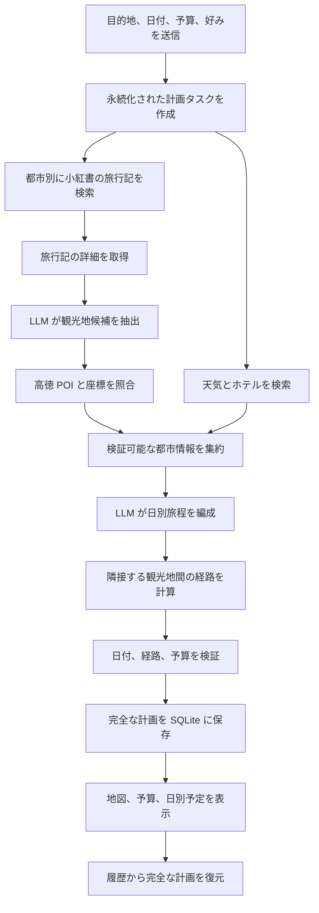
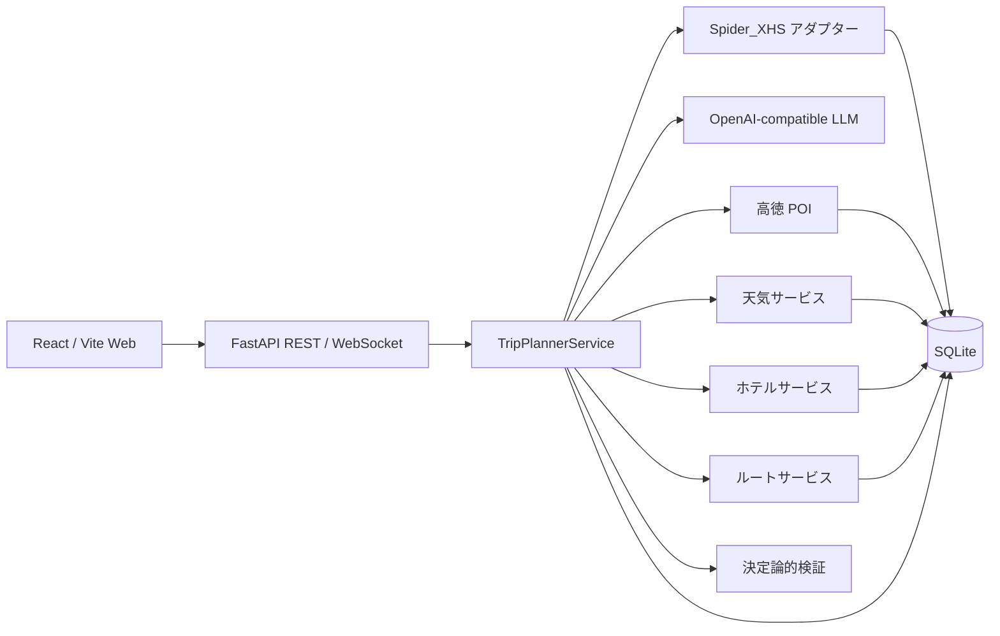

# TravelMind-AI

[](https://github.com/RichardLitt/standard-readme)
[](https://www.python.org/)
[](https://fastapi.tiangolo.com/)
[](https://react.dev/)
[](LICENSE)

> 実際の旅行コンテンツ、地図の事実情報、LLM の編成を組み合わせ、実行可能な複数日程を作成します。

[中文](README.md) | [English](README_en.md) | [日本語](README_ja.md)

TravelMind-AI は個人旅行の意思決定を支援するフルスタックアプリケーションです。目的地、
日付、予算、好みを入力すると、小紅書の旅行記を検索し、観光地候補を抽出して、高徳地図の
POI、天気、ホテル、ルート情報を補完します。その後、LLM が日別の旅程を編成します。
タスク進捗と完全な計画は SQLite に保存され、Web 画面から計画、進捗、地図、予算、履歴を確認できます。

本プロジェクトは現在、学習と技術検証を目的としています。データ提供元の規約、地域の法令、
地図サービスの利用規約を守って使用してください。

## 目次

- [背景](#背景)
- [機能](#機能)
- [インストール](#インストール)
- [使い方](#使い方)
- [業務フロー](#業務フロー)
- [アーキテクチャ](#アーキテクチャ)
- [API](#api)
- [設定](#設定)
- [永続化](#永続化)
- [プロジェクト構成](#プロジェクト構成)
- [開発とテスト](#開発とテスト)
- [セキュリティ](#セキュリティ)
- [ロードマップ](#ロードマップ)
- [関連プロジェクト](#関連プロジェクト)
- [メンテナー](#メンテナー)
- [コントリビューション](#コントリビューション)
- [ライセンス](#ライセンス)

## 背景

モデルの知識だけで生成した旅行計画には、存在しない場所、不正確な経路、古い天気情報が
含まれることがあります。TravelMind-AI は、発見、事実検索、計画判断を分離します。

- 小紅書は実際の旅行記と体験情報を提供します。
- 高徳地図は場所、座標、天気、ホテル、距離、経路手順を提供します。
- LLM は旅行記から観光地を抽出し、日別の順序と説明を編成します。
- 業務サービスはフィールド、日付、予算、キャッシュ、タスク状態、永続化を管理します。

現在の小紅書連携はリアルタイム検索であり、ベクトルデータベースやオフライン RAG ではありません。
地図と天気の数値を LLM が推測して生成することもありません。

## 機能

### 実装済み

- 単一都市向け Web フォームと、単一・複数都市に対応する REST リクエストモデル。
- 小紅書の旅行記検索、詳細取得、観光地の構造化抽出、出典記録。
- 高徳 POI 照合による住所、座標、評価、画像の補完。
- 都市別天気予報、ホテル検索、SQLite キャッシュ。
- 徒歩、車、公共交通の距離、所要時間、手順、折れ線座標。
- 観光地順序、食事、宿泊、全体提案を含む LLM の日別旅程編成。
- 日付、都市、ルート端点、予算合計の決定論的検証。
- バックグラウンドタスク、ポーリング、WebSocket 状態通知、安定したエラーコード。
- 完全な計画、日別予定、ルート区間の保存、履歴一覧、計画復元。
- 中国語・英語・日本語に対応する React 画面、高徳地図、ECharts 予算表示。
- 管理者用システムアカウントの Cookie、QR コード、電話番号ログイン。
- 認証切れ時の安定したエラーと管理画面への誘導。

### 現在の境界

- 一般ユーザーは個人の小紅書アカウントを入力しません。管理者がシステムアカウントを管理します。
- Web フォームは現在単一都市向けです。複数都市は REST API から利用できます。
- Provider が返さないホテル価格や評価は空のまま保持し、モデルで補完しません。
- 予算は現時点で確認できる概算であり、最終的な支出を保証しません。
- 現在は単一ノードの FastAPI + SQLite 構成で、マルチテナントや分散ジョブキューはありません。

## インストール

### 必要環境

- Python 3.12 以上
- [uv](https://docs.astral.sh/uv/)
- Node.js 20 以上
- npm
- 小紅書システムアカウント、高徳開発者 Key、OpenAI-compatible LLM Key

### バックエンド

```bash
uv sync
cp .env.example .env
```

### 小紅書署名ランタイム

```bash
cd vendor/spider_xhs
npm install
cd ../..
```

### Web フロントエンド

```bash
cd ui
npm install
cp .env.example .env
cd ..
```

インストール後、ルートの `.env` と `ui/.env` を設定します。実際の認証情報を Git に
コミットしないでください。

## 使い方

1 つ目のターミナルで FastAPI を起動します。

```bash
uv run uvicorn main:app --reload --host 127.0.0.1 --port 8000
```

2 つ目のターミナルで React を起動します。

```bash
cd ui
npm run dev
```

| 画面 | 既定 URL |
| --- | --- |
| Web アプリ | `http://127.0.0.1:5173` |
| 旅行計画 | `http://127.0.0.1:5173/plan` |
| 旅行履歴 | `http://127.0.0.1:5173/library` |
| システムアカウント管理 | `http://127.0.0.1:5173/admin/integrations/xhs` |
| OpenAPI | `http://127.0.0.1:8000/docs` |

`5173` が使用中の場合、Vite は別のポートを選択します。ターミナル出力を確認してください。

### 旅行計画を作成する

```bash
curl -X POST http://127.0.0.1:8000/api/trip/plan \
  -H 'Content-Type: application/json' \
  -d '{
    "city": "東京",
    "start_date": "2026-10-01",
    "end_date": "2026-10-03",
    "transportation": "transit",
    "accommodation": "快適なホテル",
    "preferences": ["グルメ", "街歩き"],
    "free_text_input": "ゆったりした日程にする",
    "language": "ja",
    "note_limit": 4,
    "travelers": 2,
    "total_budget": 6000,
    "hotel_budget_max": 900
  }'
```

`202 Accepted` と `task_id`、ポーリング URL、WebSocket URL が返ります。タスク状態は
`submitted`、`processing`、`completed`、`failed` のいずれかです。成功時の `result` は
完全な計画、失敗時は安定した `error_code` とクライアント向けメッセージを含みます。

複数都市では `city` の代わりに `cities` を使います。各都市の日数合計は開始日から終了日までの
日数と一致する必要があります。

```json
{
  "cities": [
    { "city": "東京", "days": 2 },
    { "city": "鎌倉", "days": 2 }
  ],
  "start_date": "2026-10-01",
  "end_date": "2026-10-04"
}
```

## 業務フロー



送信 API はすぐに `task_id` を返し、FastAPI のバックグラウンドタスクが計画を実行します。
Web 画面は現在ステータスをポーリングし、バックエンドは WebSocket も提供します。SQLite に
保存されたタスクと計画は、サービス再起動後も取得できます。

## アーキテクチャ



| レイヤー | ディレクトリ | 責務 |
| --- | --- | --- |
| API | `app/routers`、`app/schemas` | HTTP/WebSocket、入力検証、REST モデル、エラー |
| ドメイン | `app/models` | フレームワーク非依存の旅行、観光地、ホテル、天気、ルートモデル |
| 業務 | `app/services` | 抽出、事実検索、編成、検証、進捗 |
| 連携 | `app/integrations` | 小紅書、LLM、高徳アダプター |
| 保存 | `app/storage` | SQLite、キャッシュ、完全な計画、トランザクション |
| Web | `ui/src` | ルーティング、画面、コンポーネント、Zustand、Axios |

REST schema とドメイン model は分離されています。Provider のレスポンスはドメインオブジェクトへ
変換した後にのみ Planner またはフロントエンドへ渡されます。

## API

### 完全な旅行計画

| メソッド | パス | 用途 |
| --- | --- | --- |
| `POST` | `/api/trip/plan` | 計画タスクを送信 |
| `GET` | `/api/trip/status/{task_id}` | 進捗と最終結果を取得 |
| `WS` | `/api/trip/ws/{task_id}` | 状態変化を購読 |
| `GET` | `/api/trip/history` | 完了した計画の一覧 |
| `GET` | `/api/trip/plan/{plan_id}` | 完全な計画を復元 |

### 小紅書コンテンツ

| メソッド | パス | 用途 |
| --- | --- | --- |
| `GET` | `/api/xhs/health` | コンテンツクライアントの実行条件を確認 |
| `POST` | `/api/xhs/search` | 旅行記を検索 |
| `GET` | `/api/xhs/notes/{note_id}` | 旅行記の詳細を取得 |
| `POST` | `/api/xhs/attractions` | 旅行記検索、観光地抽出、POI 補完 |
| `GET` | `/api/xhs/attractions/{extraction_id}` | 抽出結果を復元 |

### 地図情報

| メソッド | パス | 用途 |
| --- | --- | --- |
| `GET` | `/api/poi/search` | 標準化 POI を検索 |
| `GET` | `/api/poi/detail/{poi_id}` | POI 詳細を取得 |
| `GET` | `/api/poi/photo` | 観光地画像を検索してキャッシュ |
| `GET` | `/api/map/poi` | TripStar 互換 POI 検索 |
| `GET` | `/api/weather` | 都市と日付で天気を検索 |
| `GET` | `/api/map/weather` | TripStar 互換天気 API |
| `GET` | `/api/hotels/search` | 好み、予算、地域でホテルを検索 |
| `POST` | `/api/map/route` | 2 地点間のルートを計算 |

ルート API は確定した起点と終点の距離、所要時間、案内手順だけを計算します。観光地の
訪問順序は旅程 Planner が決定します。

### システムアカウント管理

以下の API には `X-TravelMind-Admin-Key` ヘッダーが必要です。

| メソッド | パス | 用途 |
| --- | --- | --- |
| `GET` | `/api/admin/integrations/xhs/methods` | ログイン方式を取得 |
| `POST` | `/api/admin/integrations/xhs/qrcode/start` | QR ログインを開始 |
| `GET` | `/api/admin/integrations/xhs/{login_id}/qrcode` | QR コードを取得 |
| `GET` | `/api/admin/integrations/xhs/{login_id}/status` | ログイン状態を取得 |
| `POST` | `/api/admin/integrations/xhs/phone/start` | SMS コードを送信 |
| `POST` | `/api/admin/integrations/xhs/phone/verify` | SMS コードを検証 |
| `POST` | `/api/admin/integrations/xhs/cookie` | Cookie を検証して更新 |

## 設定

### バックエンド `.env`

| 変数 | 必須 | 既定値 | 用途 |
| --- | --- | --- | --- |
| `TRAVELMIND_ADMIN_KEY` | 管理画面で必須 | なし | システムアカウント API を保護する独立 Key |
| `TRAVELMIND_XHS_COOKIE` | 推奨 | なし | 起動時に小紅書セッションを復元 |
| `LLM_API_KEY` | 必須 | なし | OpenAI-compatible API Key |
| `LLM_BASE_URL` | 任意 | `https://api.openai.com/v1` | Chat Completions URL |
| `LLM_MODEL_ID` | 任意 | `gpt-4o-mini` | 抽出と計画に使用するモデル |
| `LLM_TIMEOUT` | 任意 | `180` | タイムアウト秒数 |
| `LLM_ENABLE_THINKING` | 任意 | `false` | 対応する百錬モデルの思考モード |
| `AMAP_API_KEY` | 必須 | なし | バックエンド用の高徳 Web サービス Key |
| `TRAVELMIND_DATA_DIR` | 任意 | `./data` | SQLite データディレクトリ |
| `WEATHER_CACHE_TTL_SECONDS` | 任意 | `10800` | 天気キャッシュ有効期間 |
| `HOTEL_CACHE_TTL_SECONDS` | 任意 | `86400` | ホテルキャッシュ有効期間 |
| `ROUTE_CACHE_TTL_SECONDS` | 任意 | `86400` | ルートキャッシュ有効期間 |

### フロントエンド `ui/.env`

```dotenv
VITE_AMAP_JS_KEY=your_web_js_key
VITE_AMAP_SECURITY_CODE=your_security_code
```

高徳 Web サービス Key と Web JS Key は異なります。フロントエンド変数はブラウザの成果物に
含まれるため、高徳コンソールでドメイン制限とセキュリティコードを設定してください。

## 永続化

既定では 1 つの SQLite データベースを使用します。

```text
data/travelmind.db
```

`travelmind.db-wal` と `travelmind.db-shm` は WAL モードの補助ファイルであり、別のデータベース
ではありません。小紅書の旅行記と抽出、Provider キャッシュ、計画リクエスト、タスク状態、
完全な計画 JSON、日別予定、ルート区間を保存します。

Zustand はブラウザで現在のフォームと最後に表示した計画だけをキャッシュします。履歴画面は
`/api/trip/history` と `/api/trip/plan/{plan_id}` を使用して SQLite から復元します。

## プロジェクト構成

```text
TravelMind-AI/
├── app/
│   ├── integrations/       # 小紅書、LLM、高徳アダプター
│   ├── models/             # ドメインモデル
│   ├── routers/            # REST と WebSocket
│   ├── schemas/            # 独立した API リクエスト/レスポンスモデル
│   ├── services/           # 業務サービスと完全な旅程編成
│   └── storage/            # SQLite リポジトリとキャッシュ
├── data/                   # ローカル実行データ
├── tests/                  # unittest テスト
├── ui/                     # React / Vite Web アプリ
├── vendor/spider_xhs/      # 小紅書 PC クライアントランタイム
├── .env.example            # バックエンド設定テンプレート
├── LICENSE                 # MIT ライセンス
├── main.py                 # FastAPI エントリーポイント
├── pyproject.toml          # Python メタデータと依存関係
└── TODO.md                 # ロードマップと受入項目
```

## 開発とテスト

```bash
uv run python -m unittest discover -s tests -v

cd ui
npm run lint
npm run build
```

コミット前に次も確認します。

```bash
git diff --check
```

自動テストは Fake Provider を使用し、実際の Cookie、外部ネットワーク、有料 API に依存しません。
実サービスのスモークテストは別に実行し、ログや出力に認証情報を残さないでください。

## セキュリティ

- `.env`、データベース、Cookie、API Key、非公開ログをコミットしないでください。
- 一般ユーザーは小紅書のログイン情報を扱いません。保護された管理画面だけが管理します。
- 管理 Key は独立したランダム値にし、Cookie、LLM Key、ユーザーパスワードを再利用しないでください。
- QR・電話ログイン後の Cookie は現在のサービスプロセスに保存されます。再起動をまたぐ場合は
  安全なランタイム設定を使用してください。
- API、業務テーブル、ログに Cookie、`xsec_token`、Authorization、完全な Prompt を残さないでください。
- 現在の管理 Key は公開マルチテナント向けの完全な認証システムではありません。
- 公開前に HTTPS、リバースプロキシ、レート制限、ユーザー認証、秘密情報管理、監査を追加してください。

## ロードマップ

- プロセス内タスクを、再試行・重複排除・永続化に対応するジョブキューへ移行する。
- ユーザーアカウント、旅程所有者、マルチテナント分離を追加する。
- Web フォームで複数都市と滞在日数を編集できるようにする。
- 画像の遅延読込、失敗表示、地図の E2E テストを完成させる。
- 旅程編集、部分的なルート再計算、計画バージョン保存を追加する。
- 同意範囲を定義した後、旅程質問応答と削除可能な嗜好メモリを追加する。
- 構造化監視、Provider レート制限対応、本番データベース移行を追加する。

詳細は [TODO.md](TODO.md) を参照してください。

## 関連プロジェクト

- [Spider_XHS](https://github.com/cv-cat/Spider_XHS)：小紅書 PC 署名とログインの参考。
- [TripStar](https://github.com/1sdv/TripStar)：旅行計画フローと互換 API の参考。
- [Standard Readme](https://github.com/RichardLitt/standard-readme)：本文書の構成規約。

TravelMind-AI の実装、モデル、永続化は本プロジェクトが独立して管理します。参照元のライセンスと
利用条件は各リポジトリで確認してください。

## メンテナー

- wen.yao

## コントリビューション

Issue と Pull Request を歓迎します。変更を送る前に次を確認してください。

1. 最新の main から目的が明確なブランチを作成する。
2. REST schema、ドメイン model、Provider アダプターの境界を維持する。
3. 新しい業務ルール、エラー、永続化にテストを追加する。
4. バックエンドテスト、フロントエンド Lint、production build を実行する。
5. `.env`、DB、Cookie、Key、ログ、個人情報を含めない。

## ライセンス

本プロジェクトは [MIT License](LICENSE) の下で公開されています。著作権表示とライセンス表示を
保持することを条件に、本ソフトウェアの使用、複製、変更、結合、公開、配布、再許諾、販売が可能です。

本プロジェクトが参照または同梱する第三者コードには、それぞれのライセンスと利用条件が適用されます。
